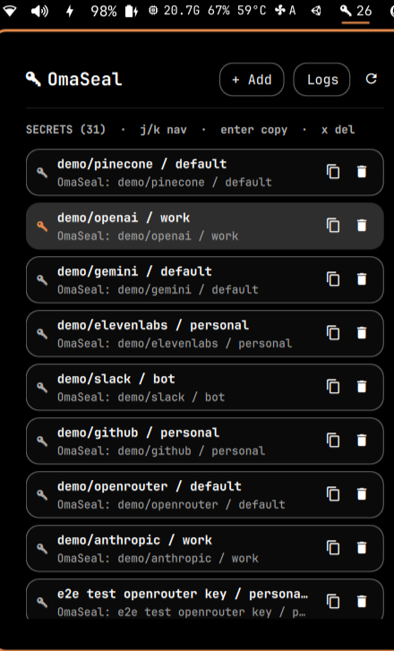

# OmaSeal

A first-party keyring for [Omarchy](https://omarchy.org). It layers a
macOS-Keychain-style secret store over the existing `gnome-keyring` /
`libsecret` stack so every Omarchy plugin can read and store secrets the same
way.

## Why

Linux has had `gnome-keyring` for years. Omarchy plugins currently reinvent
storage in `~/.config/<app>/config.json`, `.env` files, or worse, commit API
keys to dotfiles. OmaSeal is the one standard interface for secrets: ask for
`service / account`, get back the secret, and never worry about where it lives.



## What it uses

- `gnome-keyring-daemon` — Secret Service backend (already on Omarchy).
- `github.com/zalando/go-keyring` — pure Go, no CGO.
- `github.com/godbus/dbus/v5` — direct D-Bus when needed.
- Optional `op` (1Password) and `bw` (Bitwarden) CLI bridges for imports and
  fallback resolution.

## Install

### From AUR (recommended on Omarchy/Arch)

```sh
yay -S omaseal        # build from source
# or
yay -S omaseal-bin    # prebuilt multi-arch binary
```

### From a release tarball (verified)

Download the tarball, checksums, and detached GPG signature for your
architecture, then verify before installing:

```sh
ARCH=$(uname -m)
case "$ARCH" in
  x86_64)  TAR=omaseal-linux-x86_64.tar.gz ;;
  aarch64) TAR=omaseal-linux-aarch64.tar.gz ;;
  *) echo "Unsupported arch: $ARCH" >&2; exit 1 ;;
esac
curl -fsSL -O "https://github.com/duketopceo/OmaSeal/releases/latest/download/$TAR"
curl -fsSL -O "https://github.com/duketopceo/OmaSeal/releases/latest/download/sha256sums.txt"
curl -fsSL -O "https://github.com/duketopceo/OmaSeal/releases/latest/download/sha256sums.txt.asc"
sha256sum -c --ignore-missing sha256sums.txt
gpg --verify sha256sums.txt.asc sha256sums.txt
tar -xzf "$TAR"
install -Dm755 omaseal-linux-"$ARCH"/omaseal ~/.local/bin/omaseal
```

### Build from source

```sh
cd engine
go build -o omaseal .
install -Dm755 omaseal ~/.local/bin/omaseal

# Omarchy plugin
cp -r . ~/.config/omarchy/plugins/io.github.duketopceo.omaseal
omarchy-restart-shell
```

## Onboarding

```sh
omaseal doctor    # check the environment
omaseal setup     # print MCP / PATH / plugin config
omaseal agent mode <open|ask|lock> [min]  # set agent/MCP trust mode
omaseal agent unlock                      # biometric unlock for ask mode
omaseal agent lock                        # revoke agent session
omaseal agent status                      # show agent policy and session
```

See [`docs/onboarding.md`](docs/onboarding.md) for wiring OmaSeal into agents and other Omarchy apps.

## CLI

```sh
# Store (secret is read from a hidden prompt or a file; never pass it as an argument)
omaseal set openrouter default

# Retrieve (fast, local-only)
omaseal get openrouter default

# Retrieve with best-effort fprintd gate
omaseal reveal openrouter default

# Resolve: local → 1Password → Bitwarden → prompt, with local caching
omaseal resolve openrouter default

# Delete
omaseal del openrouter default

# List metadata (no secrets)
omaseal list
omaseal list openrouter --json

# Import from another vault
omaseal import 1password pace-dev
omaseal import bitwarden

# IPC for other plugins
omaseal ipc resolve '{"service":"openrouter","account":"default"}'

# MCP stdio server for agents
omaseal mcp
```

## Quickshell panel

A `BarWidget` and `Panel` are included:

- Click the **O** in the bar.
- Browse stored secrets.
- `+ Add` creates a new `service / account / secret`.
- The copy button runs `reveal` and uses `wl-copy` with a 30-second clear.
- `r` refreshes; `a` toggles the add form.

## BrowserOS (deferred)

BrowserOS integration is planned for a follow-up `omarchy-browser` PR and is not
available in this release. When implemented, BrowserOS will be able to store
provider API keys in OmaSeal, keep only an `omaseal://` reference, and resolve
the real secret just before each outbound LLM request.

See [`docs/integrations/browseros.md`](docs/integrations/browseros.md) for the
planned service/account convention and fail-closed troubleshooting guidance.

## Security model

- Secrets live in the Secret Service default/login collection, encrypted at
  rest by `gnome-keyring`.
- OmaSeal only ever sees secrets in memory; it never writes them to files,
  logs, argv, or persists them in the panel state. The secret is held only by
  the active input field until `set` completes and is then cleared.
- `list` returns metadata only.
- `reveal` triggers the `fprintd` gate when a reader is enrolled; on systems
  without one it falls through to the local secret.
- `resolve` falls back to `op` / `bw`, but always caches the result locally so
  the secret is not re-requested from the external vault.

## Agent / MCP

```json
{
  "mcpServers": {
    "omaseal": {
      "command": "</absolute/path/to/omaseal>",
      "args": ["mcp"]
    }
  }
}
```

Replace `</absolute/path/to/omaseal>` with the path to the installed binary
(usually `~/.local/bin/omaseal` or `/usr/bin/omaseal`).

Tools: `omaseal_get`, `omaseal_resolve`, `omaseal_set`,
`omaseal_delete`, `omaseal_list`.

## License

MIT
