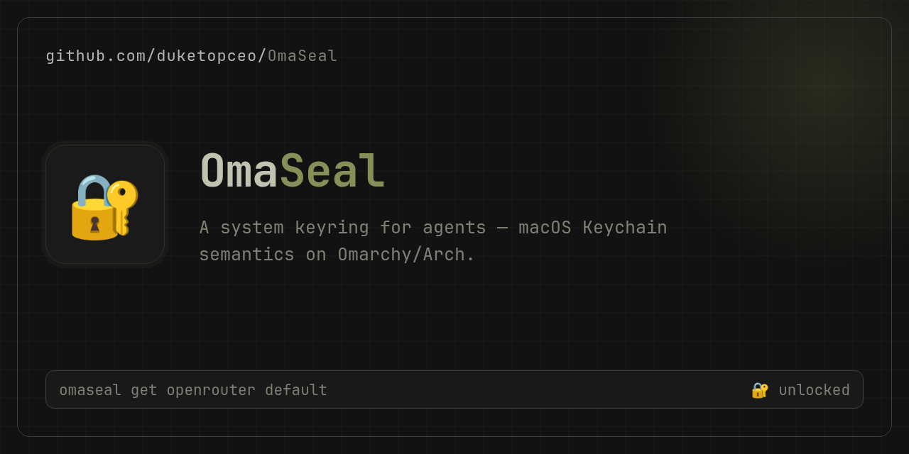
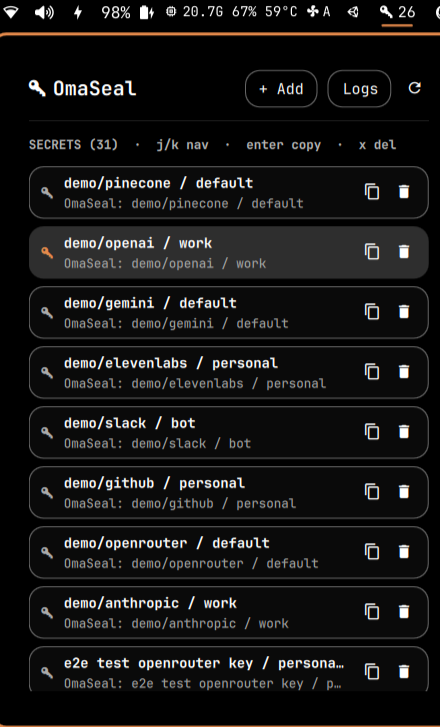

# OmaSeal

<p align="center">
  
</p>

> One keyring for your Omarchy desktop, agents, and plugins.



OmaSeal stores API keys and other secrets in the `gnome-keyring` you already
have, then gives every agent and plugin a single `service / account` interface
to get them back.

No more `.env` files, no more `~/.config/<app>/config.json` secrets, no more
copy-pasting API keys into dotfiles. Store once. Use everywhere.

## What you get

- **Quickshell panel** — browse, add, copy, and delete secrets from the bar.
- **CLI** — `set`, `get`, `del`, `list`, `resolve`, and `reveal` behind a
  user-presence gate.
- **JSON IPC** — for other Omarchy plugins to ask for secrets safely.
- **MCP server** — so Claude, Codex, Cursor, and other agents can use it.
- **1Password / Bitwarden fallback** — import and resolve when the local
  keyring does not have a secret yet.

## Why

Linux has had `gnome-keyring` for years. Omarchy plugins currently reinvent
storage in `~/.config/<app>/config.json`, `.env` files, or worse, commit API
keys to dotfiles. OmaSeal is the one standard interface for secrets: ask for
`service / account`, get back the secret, and never worry about where it lives.

## What it uses

- `gnome-keyring-daemon` — Secret Service backend (already on Omarchy).
- `github.com/zalando/go-keyring` — pure Go, no CGO.
- `github.com/godbus/dbus/v5` — direct D-Bus when needed.
- Optional `op` (1Password) and `bw` (Bitwarden) CLI bridges for imports and
  fallback resolution.

## Install

### From AUR (recommended on Omarchy/Arch)

```sh
yay -S omaseal-bin    # prebuilt multi-arch binary
```

(A source-build `omaseal` package is maintained in `packaging/aur/` but
not yet published to AUR.)

### From a release tarball (verified)

`install.sh` pins an immutable release tag (`OMASEAL_VERSION`, default
`v0.4.0`) and verifies the tarball against a checksum embedded in the
script — it never follows `latest`:

```sh
./install.sh            # pinned v0.4.0, embedded sha256 verify
./install.sh --dry-run
```

Manual equivalent — download the tarball and checksums for your
architecture from the pinned tag, then verify before installing:

```sh
VER=v0.4.0
ARCH=$(uname -m)
case "$ARCH" in
  x86_64)  TAR=omaseal-linux-x86_64.tar.gz ;;
  aarch64) TAR=omaseal-linux-aarch64.tar.gz ;;
  *) echo "Unsupported arch: $ARCH" >&2; exit 1 ;;
esac
curl -fsSL -O "https://github.com/duketopceo/OmaSeal/releases/download/$VER/$TAR"
curl -fsSL -O "https://github.com/duketopceo/OmaSeal/releases/download/$VER/sha256sums.txt"
sha256sum -c --ignore-missing sha256sums.txt
tar -xzf "$TAR"
install -Dm755 omaseal-linux-"$ARCH"/omaseal ~/.local/bin/omaseal
```

Releases may also carry a detached GPG signature (`sha256sums.txt.asc`).
When present, verify it too:

```sh
curl -fsSL -O "https://github.com/duketopceo/OmaSeal/releases/download/$VER/sha256sums.txt.asc"
gpg --verify sha256sums.txt.asc sha256sums.txt
```

### Build from source

```sh
cd engine
go build -o omaseal .
install -Dm755 omaseal ~/.local/bin/omaseal

# Omarchy plugin
cp -r . ~/.config/omarchy/plugins/io.github.duketopceo.omaseal
omarchy-restart-shell
```

## Onboarding

```sh
omaseal doctor          # check the environment (optional extras warn, never fail)
omaseal setup           # guided onboarding: doctor + wire detected agents
omaseal setup --yes     # non-interactive: auto-wire every detected agent
omaseal selftest        # set/get/delete round-trip against the live keyring
omaseal mcp status      # which agents are detected and already wired
omaseal agent mode <open|ask|lock> [min] [--ungated]  # set agent/MCP trust mode
omaseal agent unlock                      # presence-gated unlock for ask mode
omaseal agent lock                        # revoke agent session
omaseal agent status                      # show agent policy and session
omaseal agent keepalive on                # session renews on activity, lapses
                                          # after <min> minutes idle (ask mode)
omaseal agent primary claude              # set your main agent
omaseal agent defaults claude devin       # assign default agents to auto-wire
```

See [`docs/onboarding.md`](docs/onboarding.md) for wiring OmaSeal into agents and other Omarchy apps.

## CLI

```sh
# Store (secret is read from a hidden prompt or a file; never pass it as an argument)
omaseal set openrouter default

# Retrieve (fast, local-only)
omaseal get openrouter default

# Retrieve behind a user-presence gate (fingerprint, else GUI confirm)
omaseal reveal openrouter default

# Resolve: local → 1Password → Bitwarden → prompt, with local caching
omaseal resolve openrouter default

# Launch a command with secrets injected into its env (no values in config)
omaseal run -e GITHUB_PERSONAL_ACCESS_TOKEN=github/token -- npx -y @modelcontextprotocol/server-github

# Feed your sudo password to a command — only after a presence check
omaseal sudo -- apt update

# Delete
omaseal del openrouter default

# List metadata (no secrets)
omaseal list
omaseal list openrouter --json

# Import from another vault
omaseal import 1password pace-dev
omaseal import bitwarden

# Re-encrypt a plaintext (empty-password) keyring at rest
omaseal keyring status
omaseal keyring migrate [--dry-run] [--delete-old] [-y]

# Everywhere <service> <account> works, an omaseal:// reference works too
omaseal get omaseal://openrouter/default
omaseal resolve omaseal://browseros/openrouter-work/apiKey

# IPC for other plugins
omaseal ipc resolve '{"service":"openrouter","account":"default"}'
omaseal ipc set '{"service":"myapp","account":"api"}' < secret.txt

# Audit log — hash-chained, tamper-evident
omaseal logs                       # recent lines
omaseal logs verify                # check the chain
omaseal logs seal ~/seals.log      # anchor today's head somewhere off the state dir
omaseal logs verify --anchor ~/seals.log   # prove sealed history is still intact

# MCP stdio server for agents
omaseal mcp
```

## Quickshell panel

A `BarWidget` and `Panel` are included:

- Click the **O** in the bar.
- Browse stored secrets; `/` focuses the Keychain-style search field.
- `+ Add` creates a new `service / account / secret`.
- The copy button runs `reveal` and uses `wl-copy` with a 30-second clear.
- The agent trust mode (`open` / `ask` / `lock`) is shown in the header with
  an Unlock button when a session is required, the session expiry time while
  unlocked, a `·KA` marker when keep-alive is on, and the presence mechanism
  the unlock gate will use (fingerprint, GUI confirm, or ungated).
- `r` refreshes; `a` toggles the add form.

## BrowserOS (deferred)

BrowserOS integration is planned for a follow-up `omarchy-browser` PR and is not
available in this release. When implemented, BrowserOS will be able to store
provider API keys in OmaSeal, keep only an `omaseal://` reference, and resolve
the real secret just before each outbound LLM request.

See [`docs/integrations/browseros.md`](docs/integrations/browseros.md) for the
planned service/account convention and fail-closed troubleshooting guidance,
and [`docs/namespaces.md`](docs/namespaces.md) for the shared namespace rules
and `omaseal://` reference grammar every consumer should follow.

## Security model

- Secrets live in the Secret Service default/login collection, encrypted at
  rest by `gnome-keyring` — *when the keyring has a password*. On
  display-manager autologin setups no password reaches `pam_gnome_keyring`,
  leaving an empty-password keyring whose `.keyring` file is plaintext.
  `omaseal doctor` detects this (`keyring-encryption` check); fix it with
  `omaseal keyring migrate`, which re-stores everything into an encrypted
  `login` keyring via the Secret Service API — the daemon prompts for the
  new password itself (use your login password so PAM auto-unlocks), and
  `--delete-old` removes the plaintext file after verification.
- OmaSeal only ever sees secrets in memory; it never writes them to files,
  logs, argv, or persists them in the panel state. The secret is held only by
  the active input field until `set` completes and is then cleared.
- `list` returns metadata only.
- `reveal` and `agent unlock` share a user-presence gate: fingerprint via
  `fprintd` when a reader is enrolled, else a GUI confirm dialog (pinentry or
  zenity) when a graphical session and prompter exist. When neither is
  available the gate **fails closed** — `reveal`/`unlock` refuse until you
  enroll a fingerprint or install a GUI prompter. The deliberate opt-out
  for unlock-only is `omaseal agent mode ask --ungated` — itself
  presence-gated, and never honored by policy-writing surfaces. (`open`
  mode skips `agent unlock` but `reveal` still gates.) The calling
  process's stdin is never consulted, so an MCP-connected agent cannot
  confirm its own unlock.
- The same presence gate protects every action that loosens the security
  posture: `agent mode` changes to a weaker mode (including `--ungated`),
  `manifest init --force` overwrites, `manifest apply` expansions, and
  `jev enable`. Each fails closed when no fingerprint or GUI prompter can
  run — a typed `y` on a pty is forgeable (`script`, `expect`), so it is
  never treated as presence. Headless machines opt out at the filesystem
  level: edit `~/.config/omaseal/agent.json` or remove `ai-manifest.txt`
  before regenerating it.
- The audit log is **hash-chained**: every line in `omaseal.log` carries
  `chain=<sha256(prev‖line)>`, so edits or deletions of past lines break
  `omaseal logs verify`. Honest limit: a same-uid attacker who understands
  the format can recompute a forged chain — there is no secret to stop them.
  That is what `omaseal logs seal <file>` is for: seal the chain head to an
  anchor file outside the state dir (a synced repo, another machine), and
  `logs verify --anchor <file>` proves every sealed head is still present
  in the surviving chain — a rewritten history fails outright.
- **Backend selection (opt-in):** `~/.config/omaseal/config.json` accepts
  `{"backend": "native"}` to switch storage from gnome-keyring to the
  age-encrypted native store (design: `docs/design/native-store.md`).
  `set`/`del`/`list` work while locked — writes encrypt to a public key —
  and `get` prompts once per session window in a terminal, then reuses a
  tmpfs session identity (dies at logout, cleared by `agent lock`). A wrong
  passphrase is a failed read, never a write — a failed unlock cannot
  re-key the store. `secretservice` remains the default; the native store
  keeps its own items under `$XDG_STATE_HOME/omaseal/native/` (nothing is
  migrated automatically — `omaseal set` re-stores what you need).
- `omaseal sudo` feeds your sudo password to `sudo -S` — strictly a local
  CLI verb (never an MCP/IPC surface). Every attempt requires the strict
  presence gate plus a rate limit (single-pending lock, 5 attempts per
  10 min, 10 s minimum interval — denied/expired prompts count too, so
  prompt-flooding burns budget). Each attempt is logged (`sudo:` lines in
  `omaseal.log`); headless alternative is just running `sudo` yourself.
- `ai-manifest.txt` governs the **agent (MCP) channel only**. `omaseal get`,
  `omaseal run`, and IPC calls skip the policy check on purpose — the user
  who can run them already holds the keys. A DENY is a boundary for wired
  agents, not confinement: a same-uid process that ignores OmaSeal's
  interfaces can write the policy/session files or talk to Secret Service
  directly. Real isolation needs agents at a different uid or in a sandbox;
  see ROADMAP.
- `resolve` falls back to `op` / `bw`, but always caches the result locally so
  the secret is not re-requested from the external vault. Provider misses and
  the `op` availability probe are themselves cached briefly (misses ~60s), so
  pollers don't spawn external CLIs on every tick — scripts and status checks
  that only want the local store should use `get` instead of `resolve`.
- `manifest audit` lints the agent-access manifest fully locally — no network.
- Jev (optional, off by default) may send keyring *metadata* — service/account
  names, access counts, manifest rules, never secret values — to OpenRouter,
  and only after `omaseal jev enable`. See "Manifest audit + Jev" below.
- When `resolve` needs to prompt, it uses the TTY when one exists; in a
  graphical session with no TTY it opens a masked pinentry or zenity dialog
  instead. `OMASEAL_GUI_PROMPT=pinentry|zenity|off` controls the prompter;
  `omaseal doctor` reports which one is effective.

## Agent / MCP

```sh
omaseal mcp install-detected   # wire every agent found on this machine
omaseal mcp status             # see detected / installed / config path per agent
omaseal mcp install claude     # or wire one agent by name
```

Supported agents and the config each one actually reads:

| Agent | User config | Project config (`--dir`) |
| --- | --- | --- |
| `claude` | `~/.claude.json` | `.mcp.json` |
| `codex` | `~/.codex/config.toml` | `.codex/config.toml` |
| `cursor` | `~/.cursor/mcp.json` | `.cursor/mcp.json` |
| `devin` | `~/.config/devin/mcp_config.json` | `.devin/mcp_config.json` |
| `opencode` | `~/.config/opencode/opencode.json` | `opencode.json` |
| `agy` (`antigravity`) | `~/.agy/mcp.json` | `.agy/mcp.json` |
| `hermes` | `~/.hermes/mcp.json` | `.hermes/mcp.json` |

Existing servers and unrelated top-level keys are preserved; `install-*`
commands only add or replace the `omaseal` entry.

Tools: `omaseal_get`, `omaseal_resolve`, `omaseal_set`,
`omaseal_delete`, `omaseal_list`. The server also returns `instructions` at
`initialize` time, so connected agents automatically know to resolve secrets
through OmaSeal instead of asking for pastes or reading `.env` files.

To feed secrets to *other* MCP servers without putting values in config
files, wrap them in `omaseal run` — it works in every harness that takes a
`command`. Per-harness details: [docs/harness-fit.md](docs/harness-fit.md).

## Manifest audit + Jev (optional)

`omaseal manifest audit` lints `ai-manifest.txt` against the live keyring —
dead rules, uncovered items, stale secrets, advisories. Fully local, no
network, no key needed; the unfiltered inventory is used so a bad DENY rule
cannot hide evidence of itself.

`omaseal manifest audit --proposal <path>` writes a JSON proposal of safe
changes (dead-rule removals). `omaseal manifest apply <path>` renders the
parsed changes and applies them after human confirmation — it refuses
anything governing `openrouter/*` (the credential path Jev itself uses) and
requires per-item confirmation for capability-expanding changes. Headless
use: `apply --yes` applies only non-expanding changes and lists skipped
expansions; a non-TTY invocation **without** `--yes` refuses to apply
entirely. Apply is a CLI-only surface; no agent or MCP tool can reach it.

Jev is an optional decision layer on top, **disabled by default**:

- `omaseal jev status|enable|disable` controls it. Setup offers it once —
  only when an `openrouter/*` item exists — and a decline is remembered.
- While disabled, nothing Jev-related runs or touches the network.
- When enabled, the `contrib/omaseal-jev-audit` companion may send keyring
  *metadata* (service/account names, access counts, manifest rules — never
  secret values) to OpenRouter for a per-finding recommendation and
  confidence, then writes a proposal for the same human-gated apply.
- Jev proposes; only a human applies. Nothing is ever auto-applied.

To try it: `omaseal jev enable`, install the companion
(`install -Dm755 contrib/omaseal-jev-audit ~/.local/bin/`), then run
`omaseal-jev-audit` after an audit.

## License

MIT
