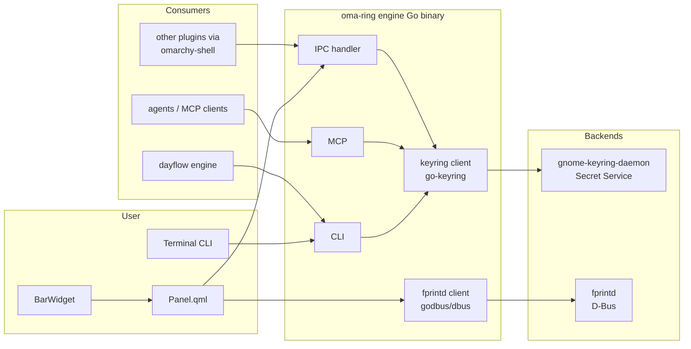
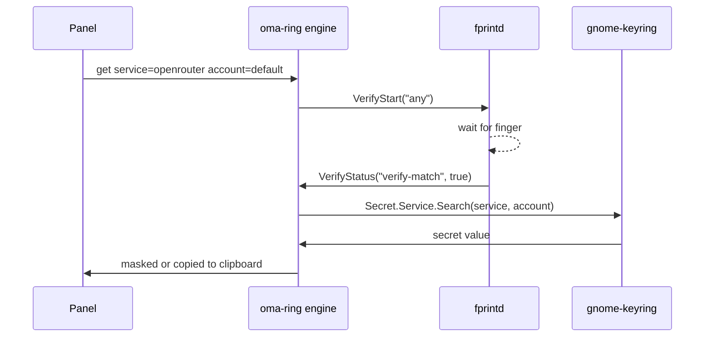

# Oma Ring: first-party Omarchy keyring plugin and upstream OS PR

## Summary

Build `oma-ring` as a clean, first-party-quality keyring product for Omarchy. It uses the existing `gnome-keyring` + `libsecret` stack, adds a Quickshell panel, a Go CLI, `fprintd` per-device authentication, an MCP/agent surface, and a standard IPC convention so other Omarchy plugins can store and request secrets. The plan also produces a concrete upstream PR spec for `basecamp/omarchy` so the keyring can migrate from a third-party plugin to a native OS feature.

---

## Problem Frame

Omarchy ships `gnome-keyring` and `libsecret`, and creates a default keyring at install. However, there is no Omarchy-native product around it:

- **No user-facing UI** for viewing, adding, or deleting secrets. Users must install `seahorse` or use `secret-tool`.
- **No plugin convention** for requesting or storing secrets. Each plugin stores API keys in its own `~/.config/<app>/config.json` with `0600` permissions.
- **No macOS Keychain equivalent** — no standard API that agents, CLIs, and panels can call.
- **No per-device authentication** beyond the OS login. macOS users get Touch ID per-secret; Omarchy users get nothing equivalent.

`oma-ring` closes that gap without inventing new crypto. It is a thin, opinionated, well-tested layer on top of the existing Secret Service.

---

## Scope Boundaries

### In scope

1. `oma-ring` Go engine: `get`, `set`, `del`, `list`, `lock`, `unlock` against `gnome-keyring`.
2. Quickshell `BarWidget` and `Panel` for visual management.
3. `fprintd` D-Bus integration for per-secret fingerprint gating.
4. `omarchy-shell` IPC target so other plugins can request secrets.
5. MCP server and CLI so agents can use the keyring.
6. Design and documentation for Dayflow to source API keys from `oma-ring`.
7. Upstream `basecamp/omarchy` PR spec for a first-party `Omakeyring` integration.
8. Marketplace-ready packaging, README, and tests.

### Deferred to follow-up work

- Cloud sync or encrypted backup.
- Import/export from 1Password, Bitwarden, KeePass.
- Multiple named collections / vaults beyond the default and a `secret` collection.
- 2FA code generation.
- SSH key generation and management.
- Team/shared secrets.
- Premium subscription enforcement (only the feature set is defined here).

### Out of scope

- Replacing `gnome-keyring` with a new encryption system.
- macOS or Windows ports.
- Audio or biometric capture beyond `fprintd`.

---

## Requirements

### R1. Core storage
Store, retrieve, and delete secrets using `service` + `account` attributes, backed by the Secret Service / `gnome-keyring` default collection.

### R2. CLI
Provide `oma-ring get|set|del|list` with secrets passed over `stdin`/`stdout` to avoid `ps` leakage.

### R3. Panel UI
A Quickshell panel listing secrets, with add/copy/delete controls and a fingerprint-gated reveal flow.

### R4. Per-device fingerprint gating
Before revealing a high-value secret, verify the user with `fprintd` over D-Bus. The keyring itself remains unlocked; the fingerprint is an authorization gate.

### R5. Plugin IPC
Register an `oma-ring` `omarchy-shell` IPC target that exposes `get`, `set`, `del`, `list`, and `ping` to other plugins.

### R6. Agent surface
Expose an MCP server (stdio) with `oma_ring_get`, `oma_ring_set`, `oma_ring_list`, and `oma_ring_delete` tools.

### R7. Dayflow integration
Produce a design document and, in the `dayflow-linux` repository, implement a provider key source that reads from `oma-ring` when `api_key` is absent from `config.json`.

### R8. Upstream spec
Produce a `basecamp/omarchy` PR design document covering PAM/fprintd keyring unlock, a first-party `omarchy-keyring` CLI, and a migration path from `oma-ring`.

### R9. Quality
All feature-bearing units have unit or integration tests. The QML panel is visually verified. `go test` and `go vet` pass.

---

## Key Technical Decisions

### KTD1. Use `gnome-keyring` + `libsecret` as the only storage backend
Rationale: the backend is already installed on Omarchy, it is maintained by GNOME, and the disk is LUKS-encrypted. No new crypto is introduced. `oma-ring` is a convenience and convention layer, not a vault.

### KTD2. Use `github.com/zalando/go-keyring` as the Go client
Rationale: pure Go, no CGO, supports Secret Service via `godbus/dbus`, and produces a static binary. Proven with the existing `oma-ring/engine/main.go` scaffold.

### KTD3. Fingerprint is a UI/auth gate, not a keyring password
Rationale: the Omarchy default keyring is passwordless and unlocks at session start. Requiring a fingerprint to unlock `gnome-keyring` would need PAM changes. Instead, `oma-ring` uses `fprintd` to authorize revealing a secret while the keyring is already open. This is a plugin-level feature, not an OS PAM change.

### KTD4. Secrets never pass through shell arguments
Rationale: `ps` and shell history are world-readable to the user session. `oma-ring set` reads from `stdin`; `get` writes to `stdout`. The `omarchy-shell` IPC call also accepts a secret over a pipe or a JSON body, not as a positional arg.

### KTD5. Free core + premium per-device features
Rationale: the marketplace story is stronger if every user gets a usable keyring manager, while fingerprint gating, collections, and imports sit behind a paid tier. This plan covers the free core and one premium feature (fingerprint) so the premium hook is real, not speculative.

---

## High-Level Technical Design



### Reveal flow with fingerprint



---

## Implementation Units

### U1. Core keyring engine

**Goal:** Add `engine/keyring.go` that wraps `go-keyring` with clean `get`, `set`, `del`, and `list` primitives.

**Requirements:** R1, R9

**Files:**
- `engine/keyring.go`
- `engine/keyring_test.go`
- `engine/main.go` (refactor to use `engine/keyring.go`)

**Approach:**
- `keyring.Get(service, account) (string, error)`
- `keyring.Set(service, account, secret) error`
- `keyring.Delete(service, account) error`
- `keyring.List(prefix) ([]Item, error)` — implement via `libsecret`/D-Bus because `go-keyring` only supports `Get/Set/Delete`. Use `godbus/dbus` to call `org.freedesktop.secrets` `SearchItems`.
- `Item` struct: `{Service, Account, Label, CreatedAt, ModifiedAt}`.

**Patterns to follow:**
- Error messages are actionable and mention `gnome-keyring-daemon` if unavailable.
- No hard-coded defaults beyond `service` and `account` attribute names.
- `list` omits secret values; only metadata is returned.

**Test scenarios:**
- Happy: set a secret, get it back, delete it, get returns not-found.
- Edge: list when no secrets exist returns empty.
- Error: no Secret Service available returns a clear error.
- Integration: metadata returned by `list` matches the attributes used during `set`.

**Verification:** `go test ./...` passes and a manual `set/get/del` round-trip works.

---

### U2. Secure CLI and IPC

**Goal:** Replace the stub `main.go` with a robust `get|set|del|list` CLI and an `omarchy-shell` IPC target.

**Requirements:** R2, R5, R9

**Files:**
- `engine/main.go`
- `engine/cli.go`
- `engine/ipc.go`
- `engine/ipc_test.go`

**Approach:**
- `set` reads the secret from `stdin` (pipe) or a hidden interactive prompt. Refuse to accept secrets as command-line arguments.
- `get` prints the secret to `stdout` with no trailing newline.
- `del` and `list` follow the same attribute model.
- `ipc` subcommand handles `omarchy-shell oma-ring <method> <json-args>`.
- IPC methods:
  - `ping` -> `ok`
  - `get {"service":"...","account":"..."}` -> secret or error
  - `set {"service":"...","account":"..."}` with stdin secret -> `ok` or error
  - `del {"service":"...","account":"..."}` -> `ok` or error
  - `list {"service":"..."}` -> JSON metadata

**Patterns to follow:**
- JSON args are small and typed; the secret payload is the only thing passed over `stdin`.
- The IPC handler returns JSON on `stdout` and error messages on `stderr`.

**Test scenarios:**
- Happy: `set` from a piped string, `get` returns the exact string, `del` removes it.
- Edge: `set` with empty secret is rejected.
- Error: `get` for missing item returns a controlled error with non-zero exit.
- Integration: an `omarchy-shell` style call (method + JSON args) round-trips correctly.
- Security: passing a secret as a positional argument to `set` is refused.

**Verification:** The CLI round-trip works, and `go test ./...` covers argument handling and JSON dispatch.

---

### U3. Quickshell panel and bar widget

**Goal:** Build the visual interface for `oma-ring`.

**Requirements:** R3, R9

**Files:**
- `BarWidget.qml`
- `Panel.qml`
- `engine/launcher.go` (optional, if needed for startup)

**Approach:**
- `BarWidget.qml` displays a lock icon or count, shows a tooltip, and toggles the panel.
- `Panel.qml` lists secrets by `service`. Each row shows `service` / `account` / `label`, with buttons to:
  - Reveal (gated by fingerprint, U4)
  - Copy to clipboard
  - Delete
  - Add new
- Add flow: fields for `service`, `account`, `label`, and a `TextArea` for the secret. `set` is called with the secret via `Process` with `Stdio` stdin.

**Patterns to follow:**
- Use the same Quickshell patterns as `dayflow-linux/BarWidget.qml` and `Panel.qml`.
- Prefer `Process` with `stdin` capture for secret input; do not log secrets.
- Visual states: empty, locked, unlocked, and errors.

**Test scenarios:**
- Happy: panel loads and lists one stored secret.
- Edge: empty keyring shows an empty-state message.
- Error: a failed `get` shows a non-blocking notice instead of crashing.

**Verification:** `omarchy-shell shell rescanPlugins` and a manual summon show the panel without QML errors. Visual screenshots are captured.

---

### U4. Fingerprint per-device authentication

**Goal:** Add `fprintd` D-Bus support so high-value reveals require a fingerprint.

**Requirements:** R4, R9

**Files:**
- `engine/fprintd.go`
- `engine/fprintd_test.go`
- `Panel.qml` (reveal flow)

**Approach:**
- Use `godbus/dbus` to call `net.reactivated.Fprint.Manager` to list devices.
- Call `Claim("")`, `VerifyStart("any")`, wait for `VerifyStatus` signal, then `VerifyStop()`.
- Wrap this as `fprintd.Verify(ctx) error` with a timeout.
- In `Panel.qml`, the `Reveal` button triggers a `fprintd` check before calling `oma-ring get`.
- A `require_fingerprint` flag can be set per item (attribute `require-fingerprint=true`); if absent, the secret is not high-value.

**Patterns to follow:**
- If `fprintd` is not installed or has no enrolled prints, the reveal falls back to a prompt or fails gracefully.
- Keep the `fprintd` code behind an interface so tests can mock the D-Bus surface.

**Test scenarios:**
- Happy: mocked D-Bus returns `verify-match`; secret is revealed.
- Edge: no enrolled prints returns a clear message and does not reveal.
- Error: device in use or permission denied is surfaced without panicking.
- Integration: a stored item with `require-fingerprint=true` requires verification; one without does not.

**Verification:** Manual fingerprint test on the laptop succeeds, and a mock-based unit test passes in CI.

---

### U5. Agent and MCP surface

**Goal:** Allow Claude, Codex, and other MCP clients to read and write secrets through `oma-ring`.

**Requirements:** R6, R9

**Files:**
- `engine/mcp.go`
- `engine/mcp_test.go`
- `README.md` (MCP install section)

**Approach:**
- Implement a small MCP server over `stdio`.
- Tools:
  - `oma_ring_get(service, account)` -> secret value
  - `oma_ring_set(service, account, secret)` -> ok
  - `oma_ring_delete(service, account)` -> ok
  - `oma_ring_list(service?)` -> JSON metadata
- Each tool returns the same JSON as the CLI for consistency.
- The MCP server reuses `engine/keyring.go`.

**Patterns to follow:**
- Follow the MCP tool naming and JSON schema from `dayflow-linux/engine/mcp.go`.
- Do not include secrets in tool `description` fields.

**Test scenarios:**
- Happy: `oma_ring_set` then `oma_ring_get` returns the value.
- Edge: `oma_ring_get` for missing secret returns an MCP error, not a panic.
- Error: malformed JSON args are rejected with a structured error.

**Verification:** `go test` covers tool dispatch, and a manual `claude mcp add` round-trip works.

---

### U6. Dayflow integration spec

**Goal:** Design how `dayflow-linux` sources API keys from `oma-ring`.

**Requirements:** R7

**Files:**
- `docs/integrations/dayflow-adapter.md`

**Approach:**
- When a provider's `api_key` is empty or set to `"oma-ring:<service>:<account>"`, `dayflow` calls `oma-ring get <service> <account>`.
- Document the attribute convention: `service=dayflow`, `account=<provider-id>`.
- Document migration: `dayflow config set openrouter_api_key ""` then `printf 'key' | oma-ring set dayflow default`.
- Keep `dayflow` fallback: if `oma-ring` is unavailable, fall back to `config.json` or fail cleanly.

**Patterns to follow:**
- No `dayflow` code is in the `oma-ring` repo. This document is a contract for the cross-repo work.

**Test scenarios:**
- Cross-repo integration test (to be written in `dayflow-linux`): a `dayflow` provider with `api_key` empty and a matching `oma-ring` entry returns the correct key.

**Verification:** The design document is reviewed and accepted before the `dayflow-linux` implementation begins.

---

### U7. Upstream Omarchy OS PR spec

**Goal:** Produce a concrete design document for `basecamp/omarchy` that describes how `Omakeyring` becomes a first-party feature.

**Requirements:** R8

**Files:**
- `docs/specs/omarchy-os-keyring.md`

**Approach:**
- Define `omarchy-keyring` as a first-party package and CLI.
- PAM/fprintd integration for unlocking the default keyring at session start.
- A `libsecret` Secret Service provider that ships with Omarchy and is always available.
- Migration from the `oma-ring` plugin: `oma-ring` exports to the new first-party store; users keep the same UI.
- A Quickshell panel in the first-party shell plugin set.
- Permissions model: which plugins can request which `service` secrets.

**Patterns to follow:**
- The spec must not edit `/usr/share/omarchy/`; it is a proposal for the upstream maintainers.
- Link to the relevant `basecamp/omarchy` files and PR process.

**Test scenarios:**
- Review: the spec is read by a second engineer and found implementable.
- Acceptance: the spec includes a migration path and does not break existing `oma-ring` users.

**Verification:** The spec is committed to the `oma-ring` repo and referenced in the marketplace submission.

---

### U8. Marketplace packaging and documentation

**Goal:** Make `oma-ring` installable and presentable.

**Requirements:** R9

**Files:**
- `README.md`
- `SUBMISSION.md`
- `AGENTS.md`
- `manifest.json`
- `preview.png`
- `LICENSE`
- `.gitignore`
- `engine/go.mod`

**Approach:**
- `README.md`: install, CLI, panel, MCP, fingerprint setup, and premium tier.
- `SUBMISSION.md`: Omarchy marketplace submission draft.
- `AGENTS.md`: rules for agents using the keyring (no secret logging, no `cat` of secret material).
- `manifest.json`: keep as a `bar-widget` with `on-demand` activation.
- `preview.png`: screenshot of the panel.
- Keep `go.mod` pinned to tested versions of `go-keyring` and `godbus/dbus`.

**Patterns to follow:**
- Marketplace submission matches the `dayflow-linux/SUBMISSION.md` structure.
- `AGENTS.md` follows the `dayflow-linux/AGENTS.md` style for agent contracts.

**Test scenarios:**
- `omarchy plugin validate .` passes.
- `go build` and `go test` pass.
- A manual install into `~/.config/omarchy/plugins` works.

**Verification:** The plugin loads, the bar widget appears, and the panel opens without errors.

---

## Output Structure

```
oma-ring/
├── manifest.json
├── BarWidget.qml
├── Panel.qml
├── README.md
├── SUBMISSION.md
├── AGENTS.md
├── LICENSE
├── .gitignore
├── preview.png
├── docs/
│   ├── plans/2026-09-05-001-feat-oma-ring-first-party-keyring-plan.md
│   ├── specs/omarchy-os-keyring.md
│   └── integrations/dayflow-adapter.md
└── engine/
    ├── go.mod
    ├── go.sum
    ├── main.go
    ├── cli.go
    ├── keyring.go
    ├── keyring_test.go
    ├── fprintd.go
    ├── fprintd_test.go
    ├── ipc.go
    ├── ipc_test.go
    ├── mcp.go
    └── mcp_test.go
```

---

## Risks & Dependencies

### Risks

1. **D-Bus / Secret Service unavailable.** Some Omarchy installs may not have a running `gnome-keyring-daemon`. Mitigation: detect absence and report a clear setup message. Plugin still installs but shows `keyring unavailable`.
2. **Fingerprint hardware not present.** `fprintd` may not be installed or no prints enrolled. Mitigation: soft fail; allow password prompt or no-gate fallback in Settings.
3. **`omarchy-shell` secret leakage.** Passing secrets through `omarchy-shell` arguments is unsafe. Mitigation: secrets travel over `stdin` or a side channel, not args.
4. **Upstream PR not accepted.** `basecamp/omarchy` may choose a different path. Mitigation: the plugin remains valuable as a standalone product.
5. **Security review.** A keyring product is high-risk. Mitigation: no custom crypto, no secret logging, `0600` on state files, tests for arg leakage, code review.

### Dependencies

- `gnome-keyring` and `libsecret` (already on Omarchy base install).
- `fprintd` for fingerprint gating (optional, on the user to enroll).
- `go-keyring` and `godbus/dbus` (pure Go, pinned in `go.mod`).
- Quickshell/omarchy shell for panel.

---

## Open Questions

1. Should `oma-ring` ship with a `systemd --user` unit, or remain a CLI-only tool invoked by the panel and agents?
2. Should the premium tier enforce a license key, or is the marketplace the only enforcement for now?
3. Which `fprintd` finger policy should the panel enforce — `any` or a configured finger?
4. Should `oma-ring` support a `search` attribute like `tags`, or keep the namespace strictly `service`/`account`?
5. What is the upstream `basecamp/omarchy` PR process — should the spec target `quattro` or `main`?

---

## Sources & Research

- `fprintd` D-Bus reference: `net.reactivated.Fprint.Manager` and `Device` interfaces, `VerifyStart`, `VerifyStatus` signals. See `https://fprint.freedesktop.org/fprintd-dev/ref-dbus.html`.
- `libsecret` search and item listing via `org.freedesktop.secrets`. See `https://gnome.pages.gitlab.gnome.org/libsecret/method.Service.search.html`.
- `omarchy-shell` IPC contract and plugin structure. See `https://github.com/basecamp/omarchy/blob/quattro/docs/omarchy-shell.md` and `https://omarchy.org/manual/shell-plugins/`.
- `go-keyring` usage and compatibility with `gnome-keyring` verified in `oma-ring/engine/main.go` scaffold.
- Quickshell panel patterns drawn from `dayflow-linux` (BarWidget and Panel structure).
