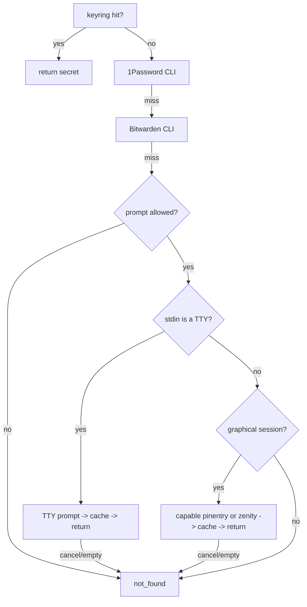

# OmaSeal: omaseal:// references, GUI credential prompt, namespace guide

---

## Goal Capsule

- **Objective:** A user or agent running `omaseal resolve` inside a graphical Omarchy session with no TTY attached gets a masked graphical prompt instead of a dead end, and any Omarchy app can store and hand around `omaseal://service/account` references that OmaSeal itself resolves.
- **Means:** extend `Resolve`'s existing source chain with a GUI prompter stage, accept `omaseal://` URIs in CLI positional args, and publish the shared namespace convention as a doc (KTD1, KTD2).
- **Authority:** this plan > repo conventions > generic Go/CLI habits.
- **Execution profile:** single-agent build on one feature branch in this repo; ship as a PR.
- **Stop conditions:** a change that would expose a secret to argv, logs, or unmasked input; any need to modify the `omarchy-browser` codebase (see Scope Boundaries).
- **Who finishes:** the implementing agent runs units, tests, and ships; the user restarts nothing.

---

## Product Contract

### Summary

OmaSeal already resolves secrets through a source chain (keyring → 1Password → Bitwarden → TTY prompt). Two gaps remain on the roadmap's v0.5.0 track: the `omaseal://service/account` reference convention exists only on paper (nothing parses it), and `resolve`'s prompt stage silently fails whenever no TTY is attached — exactly the context GUI launchers, Quickshell, and background daemons run in (issue #3). This plan closes both, publishes the shared `service`/`account` namespace guide for plugin authors, and triages the issue tracker entries whose work already shipped.

### Problem Frame

Issue #3 reports that `omaseal resolve` invoked from a GUI or headless context (Quickshell, daemons) fails when a credential is missing, because the fallback prompt expects a TTY. Separately, `docs/plans/2026-09-06-001-feat-omaseal-browseros-provider-keys-plan.md` defines `omaseal://browseros/<providerId>/<field>` references for BrowserOS — but that consumer parses the prefix itself and calls the two-arg `omaseal resolve`; no caller ever passes the URI to the CLI. Making the CLI URI-aware is what turns `omaseal://` from a naming convention into a real reference consumers can hand back verbatim. ROADMAP v0.5.0 also calls for a shared namespace guide so plugin authors pick compatible `service`/`account` names instead of fragmenting the keyring.

### Requirements

**References**

- R1. `omaseal set`, `get`, `reveal`, `del`, and `resolve` accept a single positional `omaseal://<service>/<account>` argument as an alternative to the two-argument `<service> <account>` form. The account portion may itself contain `/` segments (e.g. `omaseal://browseros/openrouter-work/apiKey` → service `browseros`, account `openrouter-work/apiKey`).
- R2. `omaseal list` accepts `omaseal://<service>` (trailing slash optional) as a service filter, in addition to a bare service name. An `omaseal://` argument carrying an account component is rejected for `list`.
- R3. Malformed references — an `omaseal`-family URI that is not well-formed (missing account where one is required, empty service, `omaseal://` alone) — are rejected with a clear error, never silently reinterpreted. A `scheme://` string whose scheme is not exactly `omaseal` (case-insensitive match on the scheme token before `://`) is treated as a literal service name, not a URI. Every accepted service/account — from either the URI or two-arg form — is validated against the charset `[A-Za-z0-9._~/-]` with a bounded length; control characters, whitespace, and `%` are rejected so values can never inject lines into the GUI prompter protocol or forge log output.

**GUI credential prompt (issue #3)**

- R4. When `omaseal resolve` is allowed to prompt, no TTY is attached to stdin, and a graphical session is present (`WAYLAND_DISPLAY` or `DISPLAY` set), OmaSeal prompts for the missing secret through a masked GUI prompter and, on success, caches it in the keyring exactly as the TTY path does.
- R5. The GUI prompt masks input and identifies itself: the dialog text names the requesting context (e.g. parent process) alongside `service`/`account` so an unsolicited prompt is recognizable. Unmasked prompt helpers (e.g. `omarchy menu input`) are never used for secrets. A pinentry invocation that resolves to a curses/TTY flavor does not satisfy this requirement.
- R6. Non-TTY invocation without a graphical session fails with the existing `not_found`-style error — no new behavior in SSH/CI contexts.
- R7. `omaseal set` keeps its current stdin contract (piped input or TTY password read); the GUI prompt applies only to `resolve`'s prompt stage.
- R8. Secrets never appear in argv, environment, logs, or the prompt's window title — only `service`/`account` and request-origin metadata may label the dialog.

**Docs and hygiene**

- R9. A namespace guide at `docs/namespaces.md` documents the `service`/`account` conventions — both the provider-named shared pattern and the app-owned pattern — plus the `omaseal://` reference format for Omarchy plugin authors (ROADMAP v0.5.0).
- R10. GitHub issues that describe already-shipped work are closed with evidence: #2 (stdio MCP server — shipped, verified live) and #4 (CI build+test workflow — on main since `93ba546`).

### Success Criteria

- `omaseal resolve omaseal://<service>/<account>` resolves an existing keyring entry end-to-end.
- `omaseal resolve <service> <account>` for a missing key, run from a Wayland session with stdin detached, produces a masked GUI prompt; entering the secret stores it and prints it.
- `go test ./...` in `engine/` covers URI parsing, prompter selection, and the Assuan exchange against a stub without requiring a display.

### Scope Boundaries

- **Deferred to Follow-Up Work**
  - BrowserOS-side units of `docs/plans/2026-09-06-001-feat-omaseal-browseros-provider-keys-plan.md` — **blocked:** the `omarchy-browser` repo is not checked out on this machine; only `omarchy-browser-ideation-stash` exists. Execution includes one unblock attempt (`gh repo view duketopceo/omarchy-browser` / locate a remote); if the repo cannot be obtained, the consumer-side plan stays deferred and the namespace conventions ship marked *provisional until exercised by a real consumer*.
  - Migrating Agent Zero's existing plaintext `.env` / `session_cookies.json` into OmaSeal — needs A0-side behavior, not OmaSeal code.
  - Issue #5 (marketplace re-validation) — awaiting an upstream maintainer; nothing to do locally.
  - Whether non-TTY prompting should be opt-in (`OMASEAL_GUI_PROMPT` required) rather than implicit whenever a display exists — decided default: implicit, because the prompt is masked and self-identifying, but flagged for the user.
  - Whether `omaseal ipc resolve` and the MCP tools should gain an opt-in `prompt` flag — they currently hardcode `prompt=false`; the GUI prompt deliberately serves bare-CLI invocations only.
- **Outside this product's identity**
  - OmaSeal is not a prompting framework; the GUI prompt is strictly a fallback inside `resolve`.
  - No change to the MCP tool surface — `omaseal_resolve`/`omaseal_get` keep explicit `service`/`account` fields.

---

## Planning Contract

### Key Technical Decisions

- KTD1. **GUI prompter chain: `pinentry` (Assuan protocol) first, `zenity --password` second — with capability probing, not presence probing.** `/usr/bin/pinentry` on Arch is a dispatcher that execs a GUI flavor only when optional libs exist (gcr, gtk3, qt6) and otherwise falls back to `pinentry-curses`, which fails with an ioctl error in exactly the no-TTY contexts this fixes; zenity is not in Omarchy's base set. So `guiPrompt` must probe what pinentry would actually do (`GETINFO flavor` over Assuan, skipping `curses`/`tty`) and probe zenity existence, preferring well-known absolute paths (`/usr/bin/pinentry`, `/usr/bin/zenity`) before `exec.LookPath` to blunt PATH-hijacking of the credential dialog. `omarchy menu input` is explicitly rejected — it renders unmasked text. `OMASEAL_GUI_PROMPT` (`pinentry`|`zenity`|`off`) is an exclusive selection override for users and tests. An optional `omaseal doctor` line reports the effective prompter.
- KTD2. **`omaseal://` parsing lives in one helper** (`engine/refs.go`), applied at CLI arg intake in `engine/main.go` so every command benefits identically. Scheme match is a case-insensitive `omaseal` token before `://`; anything else containing `://` stays a literal service name. The URI maps onto the existing `service`/`account` parameters — no new code paths downstream, and keyring storage stays untouched. The consumer contract this enables — "store the `omaseal://` ref, pass it verbatim to `omaseal resolve`" — is prescribed by the namespace doc (KTD4), which also carries shared test vectors any other parser (e.g. BrowserOS's TypeScript one) must satisfy.
- KTD3. **TTY detection switches from `ModeCharDevice` to `term.IsTerminal`.** The current check misclassifies `/dev/null` (a char device) as interactive, which makes `resolve` take the TTY-prompt path and fail with an ioctl error in daemon contexts; the same misclassification exists in `setup.go` and `ipc.go` call sites. `golang.org/x/term` is already imported.
- KTD4. **Namespace doc lives at `docs/namespaces.md`** (sibling of `docs/integrations/`), linked from `README.md`'s BrowserOS section and `ROADMAP.md`. It documents BOTH conventions and when each applies: provider-named services (`service=<provider>`, `account=default` — the shipped dayflow/mcp-instructions convention) for credentials many apps share, which also preserves the 1Password/Bitwarden title-match fallback in `providers.go`; and app-owned services (`service=<app>`, `account=<providerId>/<field>` — the browseros convention) for app-specific or multi-field credentials. It pins the `omaseal://` grammar, the validated charset, and shared test vectors, and states that CLI `resolve` is the only prompting surface (IPC/MCP callers must pre-store or handle failure).

### Assumptions

Unvalidated inferences from headless scoping — flagged for reviewer scrutiny:

- "next" means the locally executable slice of the roadmap: OmaSeal-side v0.5.0 items plus issue-tracker hygiene. The BrowserOS codebase work is excluded because its repo is absent, not because it was de-scoped upstream.
- URI support is CLI-side only; the MCP schema stays `service` + `account` fields.
- The GUI prompt attaches to `resolve` only; `get`/`reveal` keep failing closed when the key is absent.
- The uncommitted tree (v0.3.0 agent wiring WIP plus the keep-alive/session work) lands on this plan's feature branch as its own logical commits, declared in the PR description, so the feature diff stays independently reviewable — not squashed into the feature commits.

### High-Level Technical Design

`Resolve`'s source chain after this plan — the only behavioral change is the graphical-session prompt branch (the G/P nodes):

---

## Implementation Units

### U2. Fix TTY detection

**Goal:** non-terminal char devices (`/dev/null`) no longer count as interactive — enables R4/R6.
**Requirements:** R4, R6
**Dependencies:** none
**Files:** `engine/main.go`, `engine/main_test.go` (new); same misclassification fixed at `engine/setup.go` and `engine/ipc.go` call sites
**Approach:** replace the `ModeCharDevice` stat check with `term.IsTerminal`; factor to an `isTerminal(f *os.File)` helper so tests can pass pipe and `/dev/null` fds.
**Patterns to follow:** `term.ReadPassword` already uses `x/term` in `readSecret`.
**Test scenarios:**
- A pipe fd returns non-terminal.
- A `/dev/null` fd returns non-terminal.
**Verification:** `omaseal resolve svc acct </dev/null` in a graphical session no longer takes the ioctl-failing TTY path (visible once U3 lands).

### U3. GUI prompt fallback in `Resolve` (issue #3)

**Goal:** `resolve` can obtain a missing secret through a masked graphical prompt when no TTY exists (R4–R8).
**Requirements:** R4, R5, R6, R7, R8
**Dependencies:** U2
**Files:** `engine/guiprompt.go` (new), `engine/guiprompt_test.go` (new), `engine/providers.go`, optionally `engine/doctor.go`
**Approach:**
1. `graphicalSession()` reports true when `WAYLAND_DISPLAY` or `DISPLAY` is set.
2. `guiPrompt(service, account)` honors `OMASEAL_GUI_PROMPT` as an exclusive selector (`pinentry`|`zenity`|`off`), then tries a **capability-probed** pinentry, then zenity — preferring `/usr/bin/pinentry` and `/usr/bin/zenity` before `exec.LookPath`.
3. Pinentry exchange (Assuan): read the `OK` greeting first; send `SETTITLE`/`SETDESC`/`SETPROMPT` with values validated per R3 and percent-escaped for the protocol; `SETTIMEOUT` plus a hard client-side deadline so a dismissed dialog cannot block `resolve` forever; on `GETPIN` collect `D <data>` lines, percent-decode, terminate on final `OK`/`ERR`; map the cancel `ERR` to a typed cancel error; always send `BYE`/close. Probe `GETINFO flavor` (or equivalent) and skip pinentry when it resolves to `curses`/`tty`.
4. Zenity: `zenity --password` with the same validated metadata on the command line's label only; never merge child stderr into the secret buffer; cancel or empty input returns the same typed error.
5. Dialog text names the requesting context (parent process name from `/proc`) plus `service`/`account` (R5, R8).
6. In `Resolve`, extend stage 4: `prompt && TTY` stays first; when not a TTY but `graphicalSession()`, try `guiPrompt`; cache + return on success identical to the TTY branch. Note for implementers: the prompt fires only after the provider-timeout stage, so a full miss can take ~30–60s before the dialog appears.
7. Optional `omaseal doctor` line: report the effective GUI prompter (`pinentry-<flavor>`, `zenity`, or none) with remediation text.
**Test scenarios:**
- Prompter selection: `OMASEAL_GUI_PROMPT=off` yields no attempt; a named value selects only that prompter; unset tries the capability-probed chain.
- Assuan exchange against a stub `pinentry` executable emitting a greeting line, a percent-escaped `D` line, and `OK` — verifies greeting consumption, D-line decoding, and correct command sequencing; a stub returning the cancel `ERR` maps to the cancel error.
- Flavor probing: a stub pinentry reporting a `curses`/`tty` flavor is skipped in favor of zenity/none.
- No graphical session ⇒ `guiPrompt` is never attempted and `Resolve` ends in `not_found`.
- Secret caching: with the live Secret Service (the convention existing tests use — CI provides one via `dbus-run-session` + gnome-keyring), `OMASEAL_GUI_PROMPT=pinentry`, a PATH-stubbed pinentry, a fake `DISPLAY`, and non-TTY stdin, `Resolve` stores then returns the stubbed secret; keep a documented manual check for environments without a running keyring.
- Prompt text contains `service`/`account` and origin metadata, never a secret.
**Execution note:** prompter-selection and protocol tests are hermetic; an end-to-end pinentry popup is a manual check on a real session.
**Verification:** `WAYLAND_DISPLAY=wayland-1 omaseal resolve svc acct </dev/null` pops a masked dialog; entering the secret stores it; cancel produces a clean error.

### U1. Accept `omaseal://` references in the CLI

**Goal:** every OmaSeal command that takes `service`/`account` also accepts the documented `omaseal://` URI form, so consumers can store a ref and pass it back verbatim (R1–R3).
**Requirements:** R1, R2, R3
**Dependencies:** none
**Files:** `engine/refs.go` (new), `engine/refs_test.go` (new), `engine/main.go`
**Approach:**
1. Add a `parseRef`-style helper in `refs.go`: given the positional args, return `(service, account, error)`; accepts either two bare args or one `omaseal://` arg (split service on the first `/`, account keeps the remainder).
2. Scheme match is exact: a case-insensitive `omaseal` token before `://`. Any other `scheme://` string is a literal service name (`foo://bar`, `OMASEALX://y` are service names; `omaseal://` malformed refs still error).
3. Validate accepted service/account against the R3 charset (`[A-Za-z0-9._~/-]`, bounded length, no control chars/whitespace/`%`) in both URI and two-arg forms.
4. Reject `omaseal://` with missing/empty service or (where required) account; reject mixing one bare arg with a URI.
5. Wire the helper into `handleSet`, `handleGet`, `handleReveal`, `handleDel`, `handleResolve`, and the service-filter arm of `handleList` (where an account-bearing URI is rejected per R2).
6. Update `usage()` text and examples to show the `omaseal://<service>/<account>` alternative.
**Patterns to follow:** existing handlers' `os.Args` checks and `printError` usage.
**Test scenarios:**
- `omaseal://browseros/openrouter-work/apiKey` parses to `browseros` + `openrouter-work/apiKey` (multi-slash account).
- Two-arg form `browseros openrouter-work/apiKey` parses identically.
- `omaseal://browseros/` (trailing slash, no account) is an error for get/resolve but yields service `browseros` for list.
- `omaseal://` alone, `omaseal:///acct`, `omaseal://svc/acct` mixed with a second positional arg, and `omaseal://svc/acct` passed to `list` all error.
- `OMASEAL://s/a` parses (case-insensitive scheme); `omasealx://y` and `foo://bar` are treated as literal service names.
- Charset rejection: values containing newline, space, `%`, or `!` are rejected in both forms.
**Verification:** new tests pass; `omaseal resolve omaseal://<existing svc>/<acct>` prints the real key.

### U4. Namespace guide doc

**Goal:** plugin authors get one canonical doc for `service`/`account` naming and `omaseal://` references (R9).
**Requirements:** R9
**Dependencies:** U1 (doc describes the now-real URI support)
**Files:** `docs/namespaces.md` (new), `docs/integrations/dayflow.md`, `docs/integrations/browseros.md`, `README.md`, `ROADMAP.md`
**Approach:**
1. Write `docs/namespaces.md` covering: (a) provider-named services (`service=<provider>`, `account=default`) for shared credentials — preserves the op/bw title-match fallback and matches dayflow; (b) app-owned services (`service=<app>`, `account=<providerId>/<field>`) for app-specific or multi-field credentials — matches browseros; (c) the `omaseal://` grammar, the R3 charset, and shared test vectors other parsers must satisfy; (d) the consumer contract "store the ref, pass it verbatim to `omaseal resolve`"; (e) the statement that only bare-CLI `resolve` prompts — IPC/MCP callers must pre-store or handle `not_found`; (f) a warning that files containing refs are bearer-capability pointers needing protection.
2. Mark the conventions provisional-until-consumer-validated in the doc, and mark the ROADMAP v0.5.0 namespace item delivered (the guide exists; consumer validation remains the deferred BrowserOS work).
3. Reconcile `docs/integrations/dayflow.md` to reference the guide; cross-link `docs/integrations/browseros.md`; link from `README.md` alongside the existing BrowserOS doc link.
**Test expectation:** none — documentation only.
**Verification:** doc renders; README/ROADMAP links resolve; no guidance contradicts the shipped dayflow convention.

### U5. Issue-tracker triage

**Goal:** the tracker reflects reality (R10).
**Requirements:** R10
**Dependencies:** none for #2/#4 (their evidence already exists on main); #3 closes only after the PR merges — see below
**Files:** none — `gh` operations only
**Approach:**
1. Close #2 with a comment pointing at `engine/mcp.go` + verified tool list.
2. Close #4 pointing at `.github/workflows/ci.yml` on main.
3. #3: read the issue's actual reported context. If it is a GUI session with detached stdin, comment linking the PR and close on merge. If it includes no-display daemons, comment scoping the fix to graphical sessions and leave #3 open (or narrow it) — the R6 dead-end for true headless is deliberate.
4. Unblock attempt: check whether `omarchy-browser` is obtainable (`gh repo view duketopceo/omarchy-browser`, `gh repo list`); report the result in the PR body so the deferred consumer work has a concrete next step.
5. Leave #5 untouched (awaiting upstream maintainer).
**Test expectation:** none — tracker state change.
**Verification:** `gh issue list` shows only the entries that genuinely remain open.

---

## Verification Contract

| Gate | Command / check | Applies to |
|---|---|---|
| Unit tests | `cd engine && go test ./...` | U1–U3 |
| Build | `cd engine && go build -o /tmp/omaseal-test .` | U1–U3 |
| Round-trip | `omaseal selftest` (installed build) | integration |
| URI e2e | `omaseal resolve omaseal://<svc>/<acct>` returns stored secret | U1 |
| GUI e2e | `resolve` with detached stdin under Wayland shows masked prompt | U3 (manual) |
| Tracker | `gh issue list` | U5 |

## Definition of Done

- All units implemented; `go test ./...` green; `selftest` passes on the installed build.
- No secret reaches argv, env, logs, or an unmasked prompt anywhere in the new code paths.
- Issues #2/#4 closed with evidence; #3 commented and scoped per U5.
- The pre-existing WIP lands as its own declared commits; the feature diff stays independently reviewable.
- Branch pushed; PR opened against `duketopceo/OmaSeal` main; CI green or babysat to decision; the `omarchy-browser` locate/clone attempt is reported in the PR body.
- Abandoned-attempt code (alternate prompters, dead helpers) is not left in the diff.
