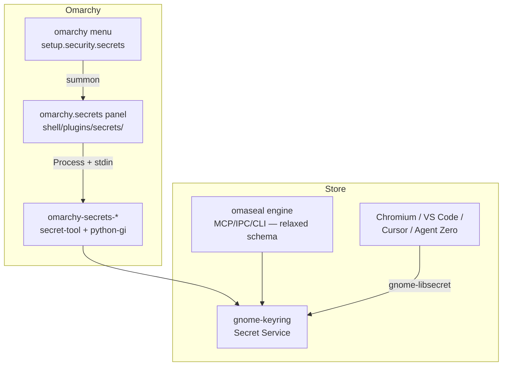

# feat: first-party secrets surface in omarchy-mac

**Target repos:** `omarchy-mac` — local checkout `~/.local/share/omarchy`, fork `duketopceo/omarchy-mac`, upstream `omacom/omarchy-mac` (default branch `quattro`; the repo transferred to the `omacom` org — `omarchy-mac/omarchy-mac` redirects to it, both names resolve). One unit (U2) lands in the omaseal repo (this checkout); all other paths are relative to `~/.local/share/omarchy` unless marked `(omaseal repo)`.

## Goal Capsule

- **Objective:** An Omarchy user can store, view, copy, and delete credentials through a shipped first-party surface — `omarchy-secrets-*` commands and a shell panel — backed by the `gnome-keyring` every install already populates (stock Chromium stores browser passwords there today via the shipped `--password-store=gnome-libsecret` flag), with no plugin install and no new packages.
- **Means:** Native `omarchy-secrets-*` commands over `secret-tool`/python-gi, a `shell/plugins/secrets/` summon panel, and a matching omaseal-side schema relaxation so both surfaces share one store (KTD1, KTD7).
- **Authority:** this plan > omarchy-mac `AGENTS.md` conventions > general practice. Session-settled decisions are labeled on their KTDs.
- **Stop conditions:** upstream maintainers require a fundamentally different shape (e.g., no in-tree panel at all); a required dependency turns out not to be in the base package set; any step would edit `/usr/share/omarchy/` on the live system (the checkout is the dev tree, not the installed one).
- **Who ships:** this pipeline authors the code and opens the PR on the fork; merge to upstream is the maintainer's call.

---

## Product Contract

### Summary

Stock omarchy-mac ships `gnome-keyring` + `libsecret` + `python-gobject` + `wl-clipboard` in the base package set and creates a passwordless default keyring at install — but exposes no surface for it, while the shipped Chromium already writes credentials into it. This plan adds the minimal first-party surface — a `secrets` command group and a summonable shell panel — using the `service`/`account` attribute schema `omaseal` uses, plus an omaseal-side change that makes the sharing bidirectional. It is the upstream half of OmaSeal's first-party roadmap item (see origin: `docs/plans/2026-09-05-001-feat-omaseal-first-party-keyring-plan.md`, R8/U7 — adapted from a spec document for `basecamp/omarchy` to real code on `omarchy-mac`).

### Problem Frame

Every default omarchy-mac install accumulates credentials in an invisible store: Chromium writes browser passwords into gnome-keyring because `config/chromium-flags.conf` ships `--password-store=gnome-libsecret`, yet no shipped command, menu entry, or panel can show them. On machines with the `omaseal` plugin, editors configured for `gnome-libsecret`, or agent tooling, more writers join the same store — still invisible without installing `seahorse` or knowing `secret-tool`. The gap is a platform gap, not a per-user one: the OS maintains a credential store it cannot show.

### Requirements

**Commands**

- R1. `omarchy-secrets-get <service> <account>` prints the secret to stdout with no trailing newline; nothing else on stdout. On multiple matches it returns the first and warns on stderr.
- R2. `omarchy-secrets-set <service> <account>` reads the secret from stdin to EOF (no size cap), rejects empty input and any positional secret argument, writes a label `Omarchy: <service> / <account>`, and updates an existing item in place — preserving its full attribute set — rather than duplicating it. It reports `created` vs `updated` on stderr.
- R3. `omarchy-secrets-delete <service> <account>` removes the item. It refuses when more than one item matches (rather than deleting another app's credential), verifies the item is gone afterward (`secret-tool clear` silently skips locked items), and reports a controlled error on a locked keyring or missing item.
- R4. `omarchy-secrets-list` prints one JSON object per item — `service`, `account`, `label`, `created`, `modified` — with `service`/`account` as `null` when an item lacks those attributes, and never any secret values.
- R5. Items are addressed by the `service`/`account` attribute pair; first-party commands stamp no plugin-specific marker.

**Panel and integration**

- R6. A first-party shell plugin `omarchy.secrets` lists items and supports copy-to-clipboard (`wl-copy --sensitive --clear-after 30` — secrets must never enter omarchy clipboard history), add, and delete, invoking the `omarchy-secrets-*` commands — never retaining secrets in QML state beyond the operation; close() wipes all secret-bearing properties.
- R7. An `omarchy menu` entry under Setup → Security opens the panel.
- R8. The change follows omarchy-mac conventions: command metadata headers, `GROUP_DESCRIPTIONS`, bash/Python style per `AGENTS.md`, and the standard QA gates pass.

**Shared store (omaseal repo)**

- R9. `omaseal` stops requiring `app=oma-ring` on reads — `findItem` and `List` match on `service`/`account` alone — and `Set` updates an existing same-service/account item in place (preserving its attributes) instead of creating a duplicate. New items keep the `app=oma-ring` marker as provenance.

### Scope Boundaries

**In scope:** the four commands, the shell panel, the menu entry, tests, the omaseal schema relaxation, and the upstream PR.

**Deferred to follow-up work:**

- Fingerprint/biometric gating for reveal (omaseal owns that layer; whether a distro-shipped secrets surface should carry an auth gate is a maintainer question — raised explicitly in the PR).
- `omaseal` panel delegation to the first-party surface (coexistence is deliberate — see Relationship to omaseal below).
- Packaging the `omaseal` Go binary into the omarchy pacman repo.
- Issue #5 marketplace re-validation (upstream-blocked on `omacom/omarchy-plugin-marketplace#5620`).
- A port to `omacom/omarchy` (x86 Omarchy) — the code is platform-agnostic and can follow if this PR lands; see KTD8.

**Outside this product's identity:** agent trust modes, MCP/IPC surfaces, GUI prompting — those stay in the `omaseal` plugin. The first-party surface is deliberately a viewer/manager, not the agent layer.

### Relationship to the omaseal plugin

Both panels manage the same store — that is the point, not an accident. The first-party surface is the distro's canonical viewer/manager; `omaseal` remains the agent layer (MCP tools, trust modes, `omaseal://` references, GUI prompting, fingerprint gating). If the PR merges, a later omaseal change may delegate its panel UI to the first-party one and keep only its agent/bar-widget roles; that decision is deferred until the merge outcome is known. The pending marketplace submission is unaffected — the plugin stays valuable standalone on any Omarchy variant.

---

## Planning Contract

### Key Technical Decisions

- KTD1. **Native commands + QML panel, not the Go binary.** The Go `omaseal` engine cannot ship inside `shell/plugins/` (first-party plugins are QML-only manifest dirs) and adding a binary package needs maintainer infrastructure. `secret-tool`, `python-gobject`, and `wl-clipboard` are already in `install/omarchy-base.packages` — the whole feature lands with zero new dependencies. (session-settled: user-approved — chosen over packaging omaseal into omarchy-mac: the origin plan's R8 proposed a first-party keyring CLI, and zero-new-deps is the only upstreamable shape)
- KTD2. **Command group is `secrets`, not `keyring`.** `omarchy-keyring` already names the pacman GPG-signing package (`bin/omarchy-update-keyring`, `docs/file-layout.md`); reusing `keyring` for the secret store guarantees user confusion and a rename in upstream review. Group `secrets`, commands `omarchy-secrets-{get,set,delete,list}`, plugin `omarchy.secrets`, menu `setup.security.secrets`.
- KTD3. **`get` uses `secret-tool lookup`; `set`, `delete`, `list` use python-gi.** `list` needs collection enumeration `secret-tool` cannot do (`search` needs attribute pairs and force-loads secret values; it also never returns `created`/`modified`). `secret-tool store` truncates piped stdin near 8KB — a silent-corruption path for PEM bundles and service-account JSON; python-gi `Secret.password_store`-family calls have no cap. `secret-tool clear` skips locked items while exiting 0, so `delete` needs the enumeration + post-verify `python-gi` gives for free. `get` stays on `secret-tool` — `lookup` has none of these hazards.
- KTD4. **`service`/`account` is a selector, not a unique key.** gnome-keyring permits multiple items sharing attributes, and other writers (VS Code `gnome-libsecret`, keytar) use the same pair. Consequences the commands must honor: `delete` refuses on >1 match; `get` warns on >1; `set` searches `{service,account}` first and updates the matched item in place (preserving whatever attributes it already carries, including `app=oma-ring`), only creating a new item on no-match.
- KTD5. **Bidirectional interop is owned by the omaseal side (R9), not by marker-stamping.** First-party commands must not stamp `app=oma-ring` — upstream code carrying a third-party plugin's marker is a layering inversion maintainers would reject, and it would silently enroll panel-stored secrets under omaseal's agent trust modes without that being chosen. Instead omaseal relaxes its filters (U2): reads match `service`/`account` alone, so omarchy-written items are visible to `omaseal get`/`list`, and omaseal `Set` updating in place (KTD4 semantics) prevents duplicates in both directions.
- KTD6. **Secrets move over stdin/stdout only, and never into clipboard history.** Same rule as `bin/omarchy-network-password` (`/proc` cmdlines are world-readable). The panel writes to the child's stdin inside `started` (the omaseal stdin-race fix), and copy uses `wl-copy --sensitive --clear-after 30` — the omarchy clipboard watcher (`shell/plugins/clipboard/capture.sh`) skips only selections carrying `x-kde-passwordManagerHint`, which `--sensitive` sets; without it every copied secret lands in `~/.local/state/omarchy/clipboard-history.json` plaintext.
- KTD7. **Panel is a summon-dismiss scrim overlay, keyboard-first, using shell `ConfirmDialog`.** A secrets manager should not linger as a floating window showing the inventory; `shell/plugins/panels/wifiqr/` is the container precedent (fullscreen `PanelWindow` + scrim + exclusive keyboard focus), `shell/Ui/PanelKeyCatcher.qml` supplies the key contract, and `shell/Ui/ConfirmDialog.qml` is the first-party confirm idiom (preferred over omaseal's arm-and-repress — still keyed by service/account, never by list index). Copy keeps the panel open (manager idiom, not picker). No `keepLoaded` — reload-per-summon is the correct default for a no-retained-secrets surface.
- KTD8. **PR targets `omacom/omarchy-mac`, with a Discussion and a phased fallback.** omarchy-mac's contributing guide routes feature ideas to Discussions, and unsolicited feature PRs get more scrutiny than the fork's prior `fix-*` PRs. The PR lands the full surface; the body links a Discussion post (opened first, same day) and offers a reduced fallback (commands + menu only, no panel) if the panel is the sticking point. `omacom/omarchy` proper is the eventual target for "official Omarchy" status (omaseal ROADMAP v1.0.0) — the feature is platform-agnostic, so a follow-up port is cheap if this lands.

### High-Level Technical Design

One store, many front-ends. New code adds the two left-side boxes and relaxes the omaseal filter (dashed-relationship at the schema layer only — no code dependency between the two repos).

### Assumptions

- Upstream accepts feature PRs from forks with maintainer engagement; the open-PR list shows the pattern for fixes, and KTD8 covers the feature-PR difference.
- The default keyring is unlocked for the session (passwordless per `install/user/default-keyring.sh`). Locked-keyring behavior is still handled (R3) rather than assumed away.
- `python-gobject` remains in the base set (line 105 of `install/omarchy-base.packages`); commands degrade with an actionable message if `gi` is absent.
- `Secret.Service.search` on the default collection with an empty attribute set enumerates all items with readable attributes — plausible per libsecret semantics but unverified against this libsecret version; spike it first in U1 before committing the `list` implementation.

### Security model

The Secret Service has no per-client ACL: item metadata and values are already readable by any same-user process via `secret-tool`, so these commands introduce no new privilege — `list` exposes nothing a same-user process cannot already read. What the surface *does* lower is the interaction bar: menu → secrets → copy needs no terminal and no typing on an unlocked session. That is accepted for this iteration (biometric gating is deferred, per Scope Boundaries, and flagged in the PR for maintainer input). Hard rules: no secret is ever logged, written to a file, passed as a command argument, placed in clipboard history, or retained in QML state past its operation.

---

## Implementation Units

### U1. `omarchy-secrets-*` command group

**Goal:** Four commands exposing get/set/delete/list over the default Secret Service collection.

**Requirements:** R1–R5, R8

**Files:**
- `bin/omarchy-secrets-get` (bash → `secret-tool lookup`)
- `bin/omarchy-secrets-set` (python-gi)
- `bin/omarchy-secrets-delete` (python-gi)
- `bin/omarchy-secrets-list` (python-gi)
- `bin/omarchy` (`GROUP_DESCRIPTIONS[secrets]="Secrets and stored credentials"`)

**Approach:**

1. `get`: thin bash wrapper — `secret-tool lookup service "$1" account "$2"`; secrets never appear as arguments. Missing item → `secret-tool`'s non-zero exit and message propagate. On >1 match (detect via a `list`-style count or accept `lookup`'s first-match with a stderr note — pick at implementation; the R1 contract is first-match-plus-warning when detectable).
2. `set`/`delete`/`list`: Python scripts using `gi.repository.Secret` (precedent: `bin/` already ships Python-shebang scripts). Shared shape per script: open `Secret.Service` / default collection, operate, emit on stdout, errors on stderr.
3. `set`: search `{service,account}` → on match, update that item's secret preserving its attribute set and label; on no match, store with `{service,account}` + label `Omarchy: <service> / <account>`; print `created`/`updated` to stderr.
4. `delete`: search `{service,account}` → 0 matches: controlled error; >1: refuse with count; exactly 1: remove and re-verify (guards the locked-keyring silent-skip).
5. `list`: search the collection with an empty attribute set (spike first — Assumptions); emit JSON lines with `null` for absent `service`/`account`; never call `load_secret`.
6. All four carry `# omarchy:group=secrets` + `summary`/`args` metadata per `agents/skills/command-metadata.md`.

**Execution note:** spike the empty-attribute collection search first; if libsecret rejects it, fall back to `Secret.Service.search` with a `SECRET_SCHEMA_DONT_MATCH_NAME` schema — record which landed.

**Patterns to follow:** `bin/omarchy-network-password` (stdout-private discipline, error style); Python-shebang precedent in `bin/`.

**Test scenarios:**

- Happy: `set` from a pipe → `get` returns the exact string byte-for-byte → `list` shows the item's metadata and label → `delete` removes it → second `get` fails.
- Edge: `list` on an empty keyring emits nothing, exit 0; account names containing `/` round-trip; a secret >8KB (e.g. a 16KB PEM-like blob) round-trips uncorrupted.
- Multi-match: two items with the same `service`/`account` but different extra attributes → `delete` refuses and reports the count; `get` returns one and warns; `set` updates the first match in place.
- Interop (needs U2): an item written by `omaseal set` appears in `omarchy-secrets-list` and reads via `omarchy-secrets-get`; an item written by `omarchy-secrets-set` is retrievable by `omaseal get`; `omarchy-secrets-set` on an omaseal-written item updates it in place (no duplicate; `app=oma-ring` preserved).
- Error: `set` with empty stdin fails; `set` with a positional secret is refused; `set`/`delete` on a locked keyring report the libsecret error (and `delete` never claims success while the item remains); `list` on a system without `python-gobject` prints an actionable install message, not a traceback.
- Metadata: `bin/omarchy commands --check` passes; `bin/omarchy secrets` prints the group listing.

**Verification:** the round-trips run against the live keyring; per-file syntax checks (`bash -n` / `ast.parse`) pass; `commands --check` green.

---

### U2. omaseal schema relaxation

**Goal:** Make omaseal's store schema-interoperable with the first-party commands — reads stop requiring the `app=oma-ring` marker; writes update in place.

**Requirements:** R9

**Dependencies:** none (independent; the interop test scenarios in U1/U3 need it)

**Files (omaseal repo):**
- `engine/keyring.go` — `findItem`/`List` drop the `app` filter; `Set` finds by `{service,account}` and updates the existing item's secret in place (preserving its attributes) instead of always `CreateItem`
- `engine/keyring_test.go` / `engine/main_test.go` — updated + new coverage
- `docs/namespaces.md` — note that omaseal-written items carry `app=oma-ring` as provenance but reads are schema-agnostic

**Approach:**

- `findItem`: search `{service,account}` only. First match wins (same semantics as KTD4).
- `List`: search `{service,account}`-bearing items — enumerate all, omit `app`-only-filtering. Items lacking `service`/`account` are skipped (they are unaddressable by any CLI — the panel/omarchy-list still shows them).
- `Set`: `findItem` first → matched item gets its secret updated via the item object (attribute set untouched — an omarchy-written item stays marker-free); no match → `CreateItem` with `{app=oma-ring,service,account}` + `OmaSeal:` label as today.
- Consequence recorded honestly: `omaseal list` now enumerates foreign items (Chromium credentials etc.) — same-user-readable anyway; the MCP/IPC surface gains no new real exposure since any same-user process can run `secret-tool`. Note it in `docs/onboarding.md`'s agent-mode section.

**Test scenarios:**

- Happy: `omaseal set` → item carries `app=oma-ring`; `omaseal set` again on same service/account → still exactly one item; `secret-tool`-written item (no `app`) is visible to `omaseal get` and `omaseal list`; `omaseal set` on a foreign `{service,account}` item updates it without adding `app` (verify via python-gi or `busctl` attribute dump).
- Edge: two same-service/account items with differing attributes — `get`/`set`/`del` operate on the first match deterministically.
- Regression: existing omaseal items remain readable; `omaseal list` output shape unchanged.

**Verification:** `go test ./engine` green; live round-trip against the real keyring including a foreign-writer item.

---

### U3. `omarchy.secrets` shell panel

**Goal:** A first-party summon panel listing keyring items with add/copy/delete.

**Requirements:** R6, R8

**Dependencies:** U1

**Files:**
- `shell/plugins/secrets/manifest.json`
- `shell/plugins/secrets/SecretsPanel.qml`
- `test/shell.d/secrets-test.sh` — only if filtering/identity logic lands in a loadable `.js` file per the `MenuModel.js` pattern; otherwise omit (no tests for QML rendering)

**Approach:**

1. `manifest.json`: `id: "omarchy.secrets"`, `kinds: ["panel"]`, `entryPoints.panel`, fields per `shell/plugins/dev-gallery/manifest.json`. No `keepLoaded`.
2. Container: fullscreen `PanelWindow` + scrim + `WlrKeyboardFocus.Exclusive` per `shell/plugins/panels/wifiqr/`; Esc and outside-click dismiss; `close()` wipes every secret-bearing property (secret field, buffered get output, pending-delete key).
3. Keys via `shell/Ui/PanelKeyCatcher.qml`: j/k/arrows move, Enter copies, x or Delete requests delete, / or type-to-filter narrows the list, r refreshes, Esc clears field-focus first then closes; `blocked` while any TextField holds focus.
4. Rows render `service / account`; items lacking them render label-only with copy/delete disabled.
5. Add form: service/account/secret fields; on save, `Process` runs `omarchy-secrets-set` and writes the secret in the `started` handler then `stdinEnabled = false`; stderr text lands in the notice on failure. Saving over an existing service/account updates in place (per R2) — the notice distinguishes `updated` from `created`.
6. Delete uses `shell/Ui/ConfirmDialog.qml` (Cancel default), addressed by the row's service/account identity — never by index.
7. Copy: `omarchy-secrets-get` stdout → `wl-copy --sensitive --clear-after 30` via stdin-in-`started`; notice reads "Copied to clipboard (clears in 30s)". Panel stays open.
8. Notice severity is an explicit flag (`noticeIsError`), not substring matching on the message.
9. Port the omaseal panel's concurrency guards (pending-copy/delete coalescing, queued refresh) — carry the fixed semantics, not the styling.

**Patterns to follow:** `shell/plugins/panels/wifiqr/` (container), `shell/plugins/dev-gallery/` (manifest + PanelKeyCatcher recipe), `shell/Ui/ConfirmDialog.qml`; omaseal `Panel.qml` for interaction semantics only.

**Test scenarios:**

- Happy: summon → items listed → add stores a secret (verifiable via `omarchy-secrets-get`) → copy puts it on the clipboard with the password-manager hint → delete removes after ConfirmDialog.
- Edge: empty keyring shows an empty state; filtering narrows without re-running the backend; a foreign-writer item (no service/account) renders label-only and non-actionable.
- Clipboard safety: after copy, `wl-paste --list-types` includes `x-kde-passwordManagerHint` and `~/.local/state/omarchy/clipboard-history.json` does not gain the secret.
- Error: failed `set` (locked keyring) shows the command's stderr in the notice; closing the panel leaves no secret text in any property.
- Keyboard: j/k navigate, Enter copies, x opens the confirm dialog, / filters, Esc unfocuses-then-closes.
- Integration (needs U2): an item added in the panel is visible to `omaseal list` and vice versa.

**Verification:** `omarchy-shell shell summon omarchy.secrets` opens the panel on the live desktop without QML errors; visual verification per `agents/skills/visual-verification.md`; `./test/shell` passes.

---

### U4. Menu entry

**Goal:** `omarchy menu` exposes the panel under Setup → Security.

**Requirements:** R7, R8

**Dependencies:** U3

**Files:**
- `default/omarchy/omarchy-menu.jsonc`

**Approach:**

- One entry `setup.security.secrets` — `"label": "Secrets"`, key/lock glyph, `action` summoning the panel — inside the existing `setup.security.*` group (fingerprint, fido2, sshd, passwordless-sudo), which is where security features live; `system.*` is the power/session menu and `trigger.*` is for pickers/tests, both weaker fits.
- No `aliases` (reserved per `AGENTS.md`/`docs/menu.md`).
- JSONC subset: whole-line `//` comments only — an inline comment on the entry line breaks the parse and silently drops every user entry (`docs/menu.md`).

**Test scenarios:**

- Happy: `omarchy menu` → Setup → Security shows "Secrets" and it summons the panel.
- Regression: `test/shell.d/menu-test.sh` and `menu-guards-test.sh` pass (they exercise `MenuModel.js` against the menu file).

**Verification:** entry visible and functional in the running menu; `./test/shell` green.

---

### U5. Ship: Discussion, PR, and omaseal-side docs

**Goal:** Land the work as a reviewable upstream PR with a maintainer-engagement path, and record the new reality in the omaseal repo.

**Requirements:** R8

**Dependencies:** U1–U4

**Files:**
- (omarchy-mac) branch `feat/secrets-panel` on `duketopceo/omarchy-mac` → PR to `omacom/omarchy-mac` (base `quattro`)
- (omarchy-mac) a Suggestion Discussion post per the contributing guide, opened before/with the PR and linked from it
- (omaseal repo) `ROADMAP.md`, `docs/onboarding.md` — first-party status + agent-mode note for the relaxed schema

**Approach:**

1. Post a short Suggestion Discussion first (feature idea per `default/agents/skills/omarchy/contributing.md`), then open the PR linking it; the PR body offers a reduced fallback — commands + menu only, panel split to a follow-up — if the panel proves contentious.
2. PR body: problem (stock Chromium already writes to the keyring; nothing shipped can read it), approach, the shared-schema interop story, the security model paragraph verbatim, the "why not seahorse" answer (foreign GTK app vs. themed keyboard-first omarchy-shell surface the distro owns), test evidence, and screenshots taken against staged demo entries only — never the author's real keyring inventory.
3. Atomic commits per omarchy-mac convention (commands / panel / menu separately; U2 is a separate commit on the omaseal branch).
4. Update omaseal `ROADMAP.md` first-party item to reflect the PR; `docs/onboarding.md` notes that omaseal now reads all `service`/`account` items.

**Test scenarios:**

- PR opens against `quattro` with the template/disclosure sections filled.
- Discussion post exists and is linked.
- No `/usr/share/omarchy/` paths touched; no real credential names or values anywhere in the PR (screenshots staged).

**Verification:** PR + Discussion URLs recorded; `gh pr view` shows it open; omaseal docs committed.

---

## Verification Contract

| Gate | Command / check | Applies to |
|---|---|---|
| CLI suite | `./test/cli` (monolithic script — add keyring checks inline only if `commands --check` doesn't cover them) | U1 |
| Shell suite | `./test/shell` (includes menu tests for U4) | U3, U4 |
| Aggregate | `./test/all` | all omarchy-mac units |
| Command metadata | `bin/omarchy commands --check` | U1 |
| Syntax | per-file `bash -n` / `ast.parse` by shebang | U1 |
| Go tests | `go test ./engine` (omaseal repo) | U2 |
| Live round-trips | `omaseal`/`omarchy-secrets-*` cross-read both directions | U1, U2, U3 |
| Clipboard safety | `wl-paste --list-types` hint + history-file check | U3 |
| Visual | running-UI check per `agents/skills/visual-verification.md` | U3, U4 |
| Review loop | QA `VERDICT: PASS` + reviewer pass per repo `AGENTS.md` | all |

## Definition of Done

- All four `omarchy-secrets-*` commands work against the live gnome-keyring: byte-exact get/set round-trip, >8KB secret uncorrupted, delete refuses multi-match and verifies removal, list emits schema-conforming JSON with nulls for foreign items.
- Bidirectional interop verified live: omarchy-written items readable by `omaseal get`/`list`; omaseal-written items readable and updatable-in-place by the omarchy commands (no duplicates).
- The `omarchy.secrets` panel summons from Setup → Security and performs list/add/copy/delete on the live desktop, keyboard-driven, no QML errors, no secret in clipboard history.
- `./test/all`, `commands --check`, syntax checks, and `go test ./engine` pass in their repos.
- A Suggestion Discussion and a PR exist on `omacom/omarchy-mac` from `duketopceo/omarchy-mac:feat/secrets-panel`.
- OmaSeal's `ROADMAP.md` and `docs/onboarding.md` reflect the outcome.
- No abandoned-attempt code, scratch files, real credential screenshots, or `/usr/share/omarchy/` edits anywhere.

## Risks & Dependencies

| Risk | Mitigation |
|---|---|
| Upstream rejects the panel or wants commands-only | KTD8 fallback scope; Discussion-first gives the maintainer a steering point before review |
| Upstream questions a no-auth-gate secrets surface | Security model stated in plan + PR verbatim; biometric gating named as the deferred answer |
| `secret-tool`/python-gi edge semantics differ at runtime (multi-line secrets, empty-attribute search) | U1 execution note spikes it first; fallback search schema recorded |
| omaseal relaxing `list` enumerates foreign items to agent surfaces | Same-user boundary already exposes them via `secret-tool`; recorded in the security model + onboarding docs |
| `python-gobject` removed from base set upstream | `set`/`delete`/`list` degrade with an actionable message; `get` unaffected |
| QML Process stdin race recurs in the new panel | Write-inside-`started` is mandatory in U3 approach; ported from the omaseal fix |

## Sources & Research

- Origin plan: `docs/plans/2026-09-05-001-feat-omaseal-first-party-keyring-plan.md` (this repo) — R8/U7 adapted: real code on omarchy-mac replaces the spec-document-for-basecamp deliverable.
- `shell/plugins/` is the first-party plugin root; `bin/omarchy-plugin-catalog` walks it with `firstParty` computed.
- `install/omarchy-base.packages`: `gnome-keyring`, `libsecret`, `python-gobject`, `wl-clipboard` — zero new deps. `config/chromium-flags.conf:3` ships `--password-store=gnome-libsecret`.
- `engine/keyring.go` (this repo): `app=oma-ring` marker on all searches/writes — the constraint U2 relaxes.
- `bin/omarchy-network-password` — the stdout-secrets convention. `bin/omarchy-update-keyring` + `omarchy-keyring` pacman package — the naming collision KTD2 avoids.
- `shell/plugins/clipboard/capture.sh` — clipboard-history skips only `x-kde-passwordManagerHint` selections (KTD6).
- `shell/plugins/panels/wifiqr/`, `shell/Ui/PanelKeyCatcher.qml`, `shell/Ui/ConfirmDialog.qml` — panel container and interaction precedents.
- `docs/menu.md` — menu schema, no-aliases rule, whole-line-comment JSONC subset, `setup.security.*` group.
- `docs/plans/2026-09-13-0118-feat-omaseal-gui-prompt-and-refs-plan.md` + PR #6 — panel race fixes (stdin-after-start, delete-by-identity, coalescing) carried into U3.
- `default/agents/skills/omarchy/contributing.md` — feature ideas route to Discussions (KTD8).
