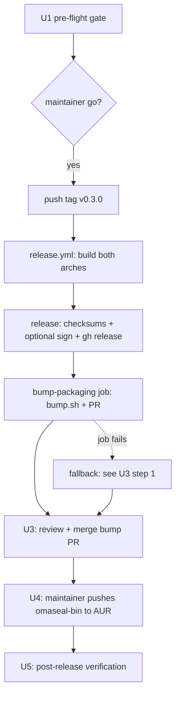

## Goal Capsule

- **Objective:** `omaseal-bin` installs a working v0.3.0 on Arch/Omarchy via `yay -S omaseal-bin`, the GitHub release carries verified both-arch tarballs, and `main`'s packaging pins match the release — with zero hand-edited checksums.
- **Means:** tag-triggered `release.yml` pipeline (build → release → `bump-packaging` PR) followed by the maintainer-gated AUR first submission (KTD1).
- **Authority:** maintainer owns the irreversible steps — tag push, AUR push, the bump PR merge, and the sudo-requiring live install. The agent verifies between gates.
- **Stop conditions:** release assets missing or checksummed wrong; bump job fails before opening its PR *and* the documented fallback cannot produce one; bump PR diff exceeds the five-file scope. Any of these halts the run before the AUR step.
- **Finishes:** the agent drives U1–U3 and the sudo-free halves of U5; the maintainer executes U4 and U5's live install.

---

## Product Contract

### Summary

v0.3.0 ships everything merged since v0.2.2 — operational logging, the organized secrets panel with usage analytics and containment fixes, `omaseal://` references with GUI prompting, and the AUR packaging pipeline itself — as the first release to exercise the automated pin-bump path end to end and the first release published to the AUR.

### Problem Frame

The packaging automation merged in PR #10 has never run against a real tag. Until a release actually flows through it, `yay -S omaseal-bin` remains vaporware: the AUR package does not exist, `install.sh` still pins v0.2.2, and the two maintainer prerequisites (the Actions PR-creation setting, the AUR account) are unverified. This release is the forcing function that proves the whole distribution chain works.

### Requirements

- R1. A `v0.3.0` tag pushed on the current `main` tip produces a GitHub release carrying `omaseal-linux-x86_64.tar.gz`, `omaseal-linux-aarch64.tar.gz`, and `sha256sums.txt`.
- R2. The `bump-packaging` job completes by opening a pin-bump PR — which requires the repo's "Allow GitHub Actions to create and approve pull requests" setting enabled beforehand — or the documented manual fallback produces an identical diff.
- R3. The bump PR is verified (exactly the five expected files; pinned hashes match the release assets) and merged so `main` carries v0.3.0 pins in `install.sh` and `packaging/aur/`.
- R4. `omaseal-bin` is published to the AUR carrying the v0.3.0 pins — `PKGBUILD` (from `PKGBUILD-bin`), `.SRCINFO`, and `omaseal-bin.install`.
- R5. Post-release state verifies on this aarch64 host: the release artifact's `omaseal --version` reports v0.3.0, `install.sh`'s embedded pins resolve the v0.3.0 tarball with a matching checksum, and the AUR package builds/installs.
- R6. The release ships unsigned by deliberate choice — `bump.sh` is invoked with `--allow-unsigned` — while the signed path remains wired for whenever the GPG secrets are configured.

### Key Decisions

- **KD1.** Version is `v0.3.0`, a minor bump. Governs R1, R5.
- **KD2.** Release payload is `main` exactly as it stands — nothing held out, nothing rushed in. Governs R1.
- **KD3.** Unsigned checksum manifest is acceptable for this release. Governs R6.

### Success Criteria

- `yay -S omaseal-bin` (or a local `makepkg` against the published AUR files) installs on this aarch64 host and the binary reports v0.3.0.
- Every pin on `main` (`install.sh` default version + both arch checksums, both PKGBUILDs, both `.SRCINFO`s) agrees with the release assets — the automated assertions in `bump.sh` make divergence a hard failure, and the U3 review makes it a human-checked one.
- The only manual edits in the whole flow are the maintainer's AUR commit and the merge button — no hand-computed hashes anywhere.

### Scope Boundaries

**Out of scope:**
- New features, engine changes, or panel changes — the payload is frozen at current `main`.
- Closing roadmap issues #2/#3/#4 — not release-blocking.
- Upstream `omarchy-mac#448` — independent maintainer-gated track.
- BrowserOS `omaseal://` runtime resolution — separate feature work.
- x86_64 install verification is best-effort — no x86 host is on hand; that arch is verified via CI artifact checksums plus U5's optional container `makepkg` check.

**Deferred to Follow-Up Work:**
- Configuring `GPG_KEY_ID` / `GPG_PRIVATE_KEY` / `OMASEAL_SIGNING_FINGERPRINT` for signed releases.
- Publishing the source-build `omaseal` AUR package alongside `-bin`.
- Refreshing the digest-pinned `archlinux` container when it goes stale.
- A shell-test harness for `bump.sh` branches beyond its in-script assertions.

---

## Planning Contract

### Key Technical Decisions

- KTD1. **Tag-push pipeline, then gated manual steps.** The release is produced entirely by pushing `v0.3.0`; `release.yml`'s existing `push: tags: v*` trigger runs build → release → `bump-packaging` with no workflow changes needed. (session-settled: user-approved — chosen over any manual release assembly: the pipeline exists precisely to eliminate that.)
- KTD2. **Unsigned release via the existing `--allow-unsigned` branch.** The bump job already selects the flag when `OMASEAL_SIGNING_FINGERPRINT` is unset, so no workflow edit is required. (session-settled: user-approved — chosen over blocking v0.3.0 on GPG key setup: matches v0.2.2's posture and keeps signing as a drop-in upgrade.)
- KTD3. **AUR submission sequenced after the bump merge, not before.** The AUR repo must receive the v0.3.0-pinned `PKGBUILD`/`.SRCINFO` metadata, and those pins only exist on `main` once U3 lands. Pushing v0.2.2 pins to AUR first would publish an already-stale package. (session-settled: user-approved — chosen over publish-when-convenient.)
- KTD4. **The bump PR merges on review, not CI.** A `GITHUB_TOKEN`-authored PR does not trigger `ci.yml` (documented in `release.yml` comments), so the merge gate is U3's scope-plus-hash verification performed by a reviewer — there is no check-suite to wait for.
- KTD5. **Agent drives everything except five maintainer gates.** The irreversible, credential-bound, or sudo-requiring actions — enabling the Actions setting, pushing the tag, merging the bump PR, pushing to AUR, and the `yay -S` live install — are explicit maintainer checkpoints; everything between them (verification, diff review, hash checking, the sudo-free sweeps) is agent work. Pushing the tag is technically agent-capable but is kept behind an explicit go because it fires the whole pipeline.

### High-Level Technical Design

The one branch that matters: if `bump-packaging` fails — most likely at `gh pr create` when the Actions setting is off — the job has usually already pushed `bump/v0.3.0` (the push precedes `gh pr create`), so the maintainer opens the PR from that branch under maintainer auth, which the Actions setting does not restrict. `make release-bump TAG=v0.3.0 BUMP_FLAGS=--allow-unsigned` on any Arch host is reserved for failures before the push; it produces the identical diff and the flow rejoins at U3 either way.

### Sequencing

Strict order: U1 → U2 → (pipeline) → U3 → U4 → U5. The only slack is U4's account/SSH setup, which can happen any time before the push itself.

---

## Implementation Units

### U1. Pre-flight gate

**Goal:** Confirm every precondition so the tag push can't strand a half-run pipeline.
**Requirements:** R2
**Dependencies:** none
**Files:** none (operational)
**Approach:**
1. Confirm `main` is synced to `origin/main`, tree clean, and the last CI run on the tip commit is green.
2. Maintainer checkpoint: confirm "Allow GitHub Actions to create and approve pull requests" is enabled (repo Settings → Actions → General). If the `gh` token carries admin scope this can be probed via the API; otherwise the maintainer confirms it in the UI.
3. Confirm signing posture is *consistent*, not just absent/present: the release job signs iff `GPG_KEY_ID` + `GPG_PRIVATE_KEY` are both set, while the bump job drops `--allow-unsigned` iff `OMASEAL_SIGNING_FINGERPRINT` is set. Pass only on an all-or-nothing state — all three set (signed path) or the GPG pair unset (unsigned path, KTD2). A partial state (keys without fingerprint, or fingerprint without keys) guarantees a signed-release/unsigned-bump mismatch and stops the run for the maintainer to resolve.
4. Probe AUR name availability early: `yay -Si omaseal-bin` / the AUR RPC should show the name unclaimed — if it is already registered by a third party, stop before any artifact depends on it (the pkgname is baked into both PKGBUILDs, both `.SRCINFO`s, and the success criteria).
5. Sanity-read the release delta: `git log --oneline v0.2.2..main` (~15 commits covering logging, panel rewrite, refs/GUI prompt, packaging). Record the `main` tip SHA — U2's tag-binding check needs it.
**Test expectation: none — operational gate, no behavioral change.**
**Verification:** all five checks recorded as pass/recorded-choice before proceeding. Any failure stops the run.

### U2. Tag and publish v0.3.0

**Goal:** Fire the pipeline and land a GitHub release with correct assets.
**Requirements:** R1, R6
**Dependencies:** U1
**Files:** none
**Approach:**
1. Maintainer go/no-go: push of `v0.3.0` on the `main` tip is the irreversible trigger — it fires builds, the public release, and the bump job.
2. Watch `release.yml`: `build` (both arches) → `release` (checksums, optional sign, release with generated notes) → `bump-packaging`.
3. Bind the tag to the reviewed commit: `git ls-remote origin refs/tags/v0.3.0` must equal the `main` tip SHA recorded in U1 — a tag on the wrong commit still produces a release reporting `0.3.0` (the manifest is stamped from the tag name), so this check is what catches a mis-targeted tag.
4. Verify release assets: two tarballs + `sha256sums.txt`, plus `.asc` only if the signed path fired. Verify each tarball's `manifest.json` reports `"version": "0.3.0"` (the build-time stamp added in PR #10).
5. Maintainer checkpoint: review and edit the auto-generated release notes (`generate_release_notes: true` produces raw commit lists) into a headline summary — panel rewrite, usage analytics, `omaseal://` refs, first AUR availability. This is the first public artifact external evaluators see.
**Test expectation: none — operational step; the pipeline itself is the mechanism under test.**
**Verification:** release page live with all expected assets; `sha256sum -c sha256sums.txt` passes against downloaded tarballs.

### U3. Review and merge the automated packaging bump

**Goal:** Land the pin bump on `main` with the human verification the CI-less PR requires.
**Requirements:** R2, R3
**Dependencies:** U2
**Files:** `install.sh`, `packaging/aur/PKGBUILD`, `packaging/aur/PKGBUILD-bin`, `packaging/aur/.SRCINFO`, `packaging/aur/omaseal-bin.SRCINFO`
**Approach:**
1. Locate the opened `bump/v0.3.0` PR. If the job failed, recover by failure point: check `git ls-remote origin bump/v0.3.0` — the job pushes the branch *before* `gh pr create`, so a `gh pr create` failure (the expected failure when the Actions setting is off) leaves a complete, scope-verified branch the maintainer can open a PR from directly (`gh pr create --head bump/v0.3.0 --base main`, unaffected by the GITHUB_TOKEN restriction). Only a pre-push failure needs the local fallback `make release-bump TAG=v0.3.0 BUMP_FLAGS=--allow-unsigned` — do not re-push to the existing branch name (non-fast-forward) and record the job's failure cause either way.
2. Verify diff scope is exactly the five files above — nothing else.
3. Spot-check pins against the release page: `install.sh` default version is `v0.3.0`, the x86_64 `EXPECTED_SHA256` matches `sha256sums.txt`'s `omaseal-linux-x86_64.tar.gz` line, same for aarch64; both PKGBUILD `pkgver`s read `0.3.0`.
4. Independent-channel check: the release page is mutable, so do not trust it alone — download the tag run's `build`-job artifacts (`gh run download`) and assert each artifact tarball's sha256 equals the pinned `EXPECTED_SHA256`. This binds the pins to CI output, so a post-publish asset swap on the release page cannot propagate through `bump.sh` into `install.sh` and the PKGBUILD.
5. Maintainer checkpoint: merge (KTD4 — no CI to wait on; this review IS the gate).
**Test scenarios:**
- Scope check: the PR's changed-file list equals the five expected paths — any extra file blocks merge.
- Hash binding: each `EXPECTED_SHA256` sits under its correct `case` arm (the regex bug class the code review caught — verify visually this once on the real output).
- No-op sanity: re-running `bump.sh v0.3.0 --allow-unsigned` post-merge produces a clean tree (proves pins converged, not just changed).
**Verification:** post-merge `main` carries v0.3.0 pins; `bump.sh` no-op check passes.

### U4. First AUR submission of `omaseal-bin` (maintainer-gated)

**Goal:** Publish the package so `yay -S omaseal-bin` resolves.
**Requirements:** R4
**Dependencies:** U3
**Files:** `packaging/aur/PKGBUILD-bin` (published as `PKGBUILD`), `packaging/aur/omaseal-bin.SRCINFO` (published as `.SRCINFO`), `packaging/aur/omaseal-bin.install`
**Approach:**
1. Maintainer: AUR account + SSH key at aur.archlinux.org (credential step, cannot be agented).
2. Clone `ssh://aur@aur.archlinux.org/omaseal-bin.git`, copy the three files above into it under their published names, commit as `omaseal-bin 0.3.0-1`, push.
3. The exact commands live in `docs/packaging.md` "One-time setup" — that section's `0.2.2-1` example becomes `0.3.0-1` in practice.
**Test scenarios:**
- `yay -Si omaseal-bin` resolves the package from AUR post-push.
- `makepkg -f` in a scratch dir with the published files produces `omaseal-bin-0.3.0-1-aarch64.pkg.tar.zst` (the `docs/packaging.md` local-verification flow, run before the push if the maintainer wants a pre-flight).
**Verification:** the AUR page/API lists `omaseal-bin` at 0.3.0-1.

### U5. Post-release verification

**Goal:** Prove the whole chain on real installs, then sweep the small leftovers.
**Requirements:** R5
**Dependencies:** U4 (U3 alone is enough for the `install.sh` halves)
**Approach:**
1. Maintainer checkpoint (sudo, cannot be agented): `yay -S omaseal-bin` on this host; `omaseal --version` reports v0.3.0. Note the documented shadowing: the package's `/usr/bin/omaseal` and the panel plugin land in first-party paths that take precedence over the `~/.local/bin` binary and `~/.config/omarchy/plugins` copy — confirm which copy the shell actually loads afterward.
2. `install.sh` check (agent, no sudo): fetch it at `main` and confirm the embedded pins match `sha256sums.txt`; a full fresh-HOME install run is optional but is the strongest proof.
3. Docs sweep — claim-consistency, not just version literals: update `docs/packaging.md`'s `0.2.2-1` example to `0.3.0-1`; fix README's manual-verification block, which fetches `sha256sums.txt.asc` and runs `gpg --verify` unconditionally — a 404 for this unsigned release (already broken for v0.2.2); gate it behind a "signed releases" note. Same for `docs/promo/tease.md`'s "signed tarballs and AUR packages" claim. Leave `manifest.json`'s `"0.2.2"` alone — it is a build-stamped placeholder, not a pin (see DoD).
4. ROADMAP: the real stale line is the open `v0.6.0` item "AUR package (`omaseal-bin`) and release automation hardened" — the published-package half is now true; the "hardened" half partially defers (bump.sh test harness), so tick or split per maintainer judgment. The panel/refs/analytics items are already ticked — do not re-add them.
5. Optional x86_64 execution check: the majority arch (upstream Omarchy is x86_64) is otherwise verified by checksum only — a one-off `makepkg -f` of the published files in the same `archlinux` container shape the `bump-packaging` job uses, or on any x86_64 machine, closes that gap.
**Test scenarios:**
- AUR install path produces a working `omaseal` binary reporting `v0.3.0`.
- `install.sh`'s `EXPECTED_SHA256` values equal the release `sha256sums.txt` entries for both arches.
- No repo file outside `docs/plans/` history still points new work at v0.2.2 pins (`manifest.json`'s build-stamped placeholder is exempt).
**Verification:** all three checks pass; ROADMAP reflects shipped state.

---

## Verification Contract

| Gate | Command / check | Applies to |
|---|---|---|
| Engine regression | `cd engine && go test ./...` | U1 pre-flight (main must already be green) |
| Asset integrity | `sha256sum -c sha256sums.txt` on downloaded release assets | U2 |
| Pin convergence | `packaging/aur/bump.sh v0.3.0 --allow-unsigned` produces a clean tree post-merge | U3 |
| Package build | `makepkg -f` + `pacman -Qip` on the AUR files | U4 |
| Live install | `yay -S omaseal-bin` → `omaseal --version` = v0.3.0 | U5 |
| Installer pins | `install.sh` literals match `sha256sums.txt` | U5 |

## Definition of Done

- GitHub release `v0.3.0` live with both-arch tarballs and checksums.
- `main` carries v0.3.0 pins via the merged (or manually equivalent) bump PR.
- `omaseal-bin` visible on the AUR at 0.3.0-1 and installs cleanly on this host.
- `install.sh` resolves and verifies v0.3.0 end-to-end.
- No stray version literals left pointing at v0.2.2 outside historical plan docs — **except `manifest.json`**, whose in-repo `"0.2.2"` is a placeholder stamped from the tag into each release tarball at build time, not a pin.
- No abandoned artifacts: any scratch build dirs, temp clones, or failed-attempt branches are removed.

---

## Appendix

**Maintainer-owned items (cannot be agented):**

| Item | Where | Blocks |
|---|---|---|
| "Allow GitHub Actions to create and approve pull requests" | Repo Settings → Actions → General | U2's bump job |
| Git tag push `v0.3.0` | maintainer's git / `git push` | U2 |
| Release-notes review/edit | GitHub release page | U2 (quality, not a blocker) |
| Bump PR merge | GitHub | U3 |
| AUR account + SSH key | aur.archlinux.org | U4 |
| AUR `git push` to `omaseal-bin.git` | maintainer's clone | U4 |
| `yay -S omaseal-bin` live install | this host (sudo) | U5 step 1 |
| Optional: `GPG_KEY_ID`, `GPG_PRIVATE_KEY`, `OMASEAL_SIGNING_FINGERPRINT` | repo secrets — all three or none | signed releases (deferred) |

**Fallbacks already documented:** `make release-bump TAG=v0.3.0 BUMP_FLAGS=--allow-unsigned` reproduces the bump job's diff on any Arch host (required flag for this unsigned release; add `OMASEAL_SIGNING_FINGERPRINT` locally if the signed path fired); `docs/packaging.md` carries the full AUR copy/push flow and local-verification recipe.

**Deferred questions for the maintainer (non-blocking):**

- Should `v*` tags get a GitHub ruleset (no deletion/force-update)? `install.sh` treats the tag as immutable; nothing currently enforces it.
- Is `actions/attest-build-provenance` worth adding as an interim integrity channel while GPG signing stays deferred?
- Publish a `omaseal` source package too, to hold the canonical name against squatting — or accept that exposure until the deferred follow-up?
- Is v0.3.0 a quiet distribution-proving cut or the public launch `docs/promo/tease.md` was drafted for? The answer sizes the release-notes effort.
- `PKGBUILD-bin`'s `pkgdesc` says "First-party Omarchy keyring manager" while ROADMAP places official-Omarchy status at v1.0 — worth softening before the first public AUR listing?

**Residual risks recorded, not resolved:** a `gh run rerun` of the bump job after a post-push failure collides non-fast-forward on the existing `bump/` branch (recover via maintainer `gh pr create`, not rerun); `main` advancing between tag and bump-PR open leaves the branch behind but still mergeable; GitHub has regenerated source-archive digests ecosystem-wide before (affects only the unpublished source `PKGBUILD`, not `-bin`); `depends=('org.freedesktop.secrets')` is a virtual provide that would prompt interactively if no provider were installed (moot on Omarchy); the digest-pinned `archlinux` container drifts stale and needs deliberate refresh (already in Deferred to Follow-Up Work).
