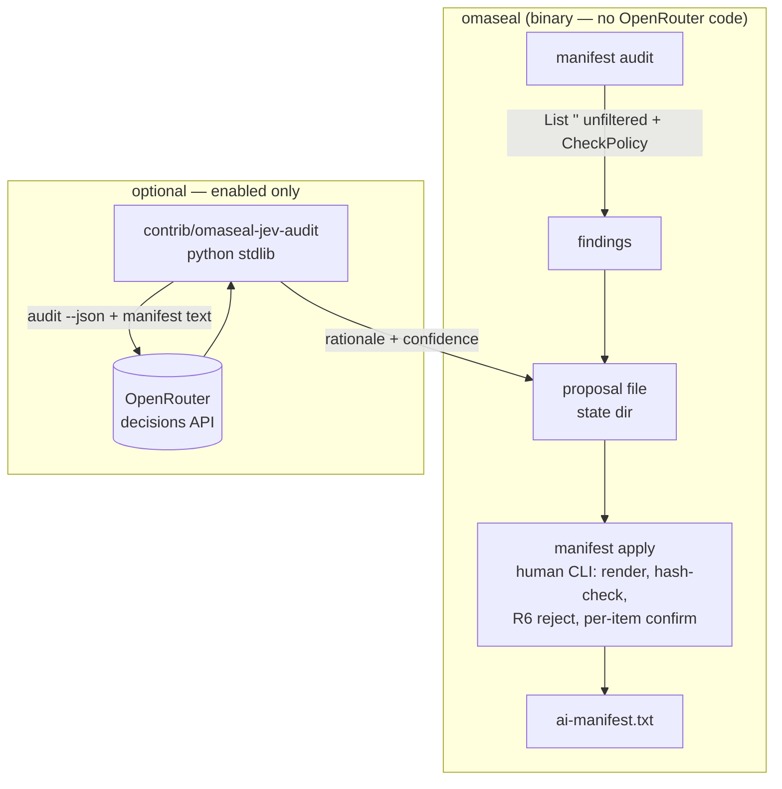

## Goal Capsule

- **Objective:** Any OmaSeal user can lint their AI manifest against the real keyring (`omaseal manifest audit`) and apply reviewed rule changes through a human gate (`omaseal manifest apply`); users who opt in get Jev's rationale/confidence layer on the same findings.
- **Means:** local linter inside the binary + human-only CLI apply + external Python companion under `contrib/` (KTD1–KTD3).
- **Authority:** origin requirements doc → this plan's KTDs → implementer judgment on details.
- **Stop conditions:** Jev must reach inside the binary, `apply` becomes agent-callable, or the proposal format can't bind to the audited manifest — stop and report rather than improvise.
- **Execution profile:** 5 units, one PR. Security-adjacent (manifest is a policy surface); test scenarios are part of done.
- **Finish/ship:** implementer runs units in order, opens the PR; merging stays with the user (main is frozen at `20a19ae` for marketplace attestation — this PR lands after).

## Product Contract

### Summary

Phase 1 of the Jev decision layer. `manifest audit` ships as a built-in local linter for every user — no OpenRouter key required — detecting dead rules, uncovered items, stale items, and item-level advisories. When Jev is enabled, the optional companion script enriches findings into a proposal file with per-item rationale and confidence. `manifest apply` is the human-only gate that binds a proposal to the audited manifest and enforces the circularity guard mechanically.

### Problem Frame

The manifest is hand-written and drifts: a live audit already surfaced a stale `test/service` entry, dead rules, and uncovered items. The demonstrated value is mechanical — the AI layer adds explanation, not detection. The security review (see origin) forced two shape corrections now settled: Jev is an external companion reading local files (no per-agent identity exists to grant it), and `apply` is human-run only, so no agent surface can reach it.

### Requirements

**Audit (local, always available)**

- R1. `omaseal manifest audit` runs without any OpenRouter/Jev dependency and reports: dead rules (pattern matches no current item), uncovered items (governed only by the fallback `ASK *`), stale items (never accessed or not accessed within a bounded window), and item-level advisories (whitespace-named items rules can't express, leftover test entries, duplicate targets).
- R2. Audit reads the **unfiltered** keyring inventory (`List("")`) — manifest DENY filtering must never blind the audit to the items a rule hides.
- R3. Audit output is grouped, counts-first, `--json` capable, and may return "no findings" — no manufactured diffs.

**Proposal + apply (human gate)**

- R4. With Jev enabled, the companion produces a **proposal file** (JSON, 0600) under the OmaSeal state dir recording: base manifest hash, generation timestamp, and a change list `{action, policy, pattern, description, rationale, confidence, expands_access}`. `expands_access` is a **display hint only** — `apply` recomputes expansion from the parsed change itself and never trusts the field.
- R5. `omaseal manifest apply <proposal>` renders the parsed rule changes it will commit and **refuses when the manifest changed since the proposal was generated** (stored `manifest_sha256` vs. current). The gate binds to applied content through render-then-confirm: the human reviews what the file actually contains — a tampered proposal is still rendered truthfully and judged on its parsed changes.
- R6. `apply` **rejects** any change whose pattern governs `openrouter/*` (Jev's credential path), including wildcard patterns that would cover it — Jev can never move its own leash, even if a human rubber-stamps it.
- R7. Every **capability-expanding** change (DENY→ALLOW, ASK→ALLOW, wildcard broadening, removing a DENY) requires explicit per-item confirmation; escalation cannot hide inside a benign diff. Without a TTY, `apply --yes` applies non-expanding changes only and exits nonzero listing the skipped expansions — headless mode can never apply escalation.
- R8. Proposals that *reduce* access are annotated prominently in the proposal file and at apply-render time.

**Enablement**

- R9. Jev is OFF by default. `omaseal jev enable|disable|status` manages an explicit enabled-state artifact; `omaseal setup` offers enablement when an `openrouter/jev` or `openrouter/default` credential exists, states what it consents to (metadata — never secret values — sent to OpenRouter), and persists a decline so it never re-asks.
- R10. A doctor/status line reports enabled state, last run, and blocked reason — an enabled-but-broken Jev is never indistinguishable from "no findings."
- R11. Marketplace listing/README/privacy text disclose the opt-in metadata path to OpenRouter before the feature ships (current listing claims "no cloud dependency").

**Companion**

- R12. The companion lives at `contrib/omaseal-jev-audit` — Python stdlib only, modeled on `jev-triage`: reads the key via `omaseal get openrouter jev` (fallback `openrouter/default`), calls the OpenRouter decisions endpoint, never prints the key.
- R13. Jev consumes metadata only — service/account names, rule text, usage counts, timestamps. No secret value field may serialize into its payload.
- R14. Jev failure (no key, API error, timeout, disabled) is a silent skip on the audit path — the local lint output stands alone.

### Scope Boundaries

**Deferred for later (from origin):** Phase 2 access-log watch (detached, notify-send) and Phase 3 runtime trust gate proceed only after real audits demonstrate applied value. The dev-side hook + CI track (origin R7) is independent and gets its own plan.

**Outside this product's identity:** Jev never auto-applies at any confidence; the shipped binary contains no OpenRouter client; `apply` is never agent-callable.

### Deferred to Follow-Up Work

- Per-agent identity/permission subsystem (the descoped original architecture) — separate workstream.
- Dev-side pre-commit hook + PR CI gate (origin R7) — separate plan.

> **Pre-work note (not a unit):** the uncommitted `engine/mcp.go` sort-enum schema fix sitting in the working tree predates this branch — land it as its own `fix:` commit on this branch before unit work (it is unrelated but real).

## Planning Contract

### Key Technical Decisions

- KTD1. **Audit is in-binary local lint** (`session-settled: user picked local-lint + optional Jev layer over Jev-gated audit`). Findings are derivable from `List("")` + `Manifest.CheckPolicy` + analytics stats — no external call. Governs R1–R3.
- KTD2. **Jev is an external companion, not an MCP agent** (`session-settled: user approved revised architecture`). The codebase has no per-agent identity; the companion runs as the local user reading `audit --json` output and the manifest file directly, per the `jev-triage` precedent. Governs R4, R12–R14.
- KTD3. **`manifest apply` is a human-only CLI subcommand** — never registered on the MCP surface. The human gate is structural. Governs R5–R8.
- KTD4. **Proposal↔manifest binding by content hash.** The proposal records `manifest_sha256` at generation; `apply` recomputes and refuses on drift. No clock/TTL games — the file either matches the audited manifest or it doesn't. Governs R5.
- KTD5. **Enabled state is a config artifact** (`~/.config/omaseal/jev.json`: `{enabled, offered_declined, last_run, last_blocked_reason}`) — config dir for policy-adjacent state, consistent with `ai-manifest.txt` placement; proposals go under `~/.local/state/omaseal/jev/`.
- KTD6. **Pattern-matching shared with `CheckPolicy`.** Dead-rule/uncovered detection must use the same match semantics (exact → `svc/*` → `*`/`*/*`) — extract a `patternMatches(pattern, service, account)` helper rather than fork the logic, or audit and enforcement will disagree.

### High-Level Technical Design

## Implementation Units

### U1. Audit linter engine + `manifest audit` subcommand

- **Goal:** mechanical findings against the real keyring, no external deps.
- **Requirements:** R1–R3, R14 (standalone output).
- **Dependencies:** none.
- **Files:** `engine/manifestaudit.go` (new), `engine/manifest.go` (add `audit`/`apply` to `handleManifest` switch + usage line), `engine/manifestaudit_test.go` (new).
- **Approach:** new file holds the finding types + checks; `List("")` supplies the unfiltered `[]Item` (usage stats already merged via `analytics.go`). Checks: dead rule = pattern matches zero items (excluding `*`/`*/*` catch-alls, which are structural); uncovered = item hits only the fallback; stale = `AccessCount==0` or `LastAccessed` older than 90 days (constant, documented); advisories = whitespace names (rules can't express them — `GenerateDefaultManifest` already detects this), `test/*`-shaped leftovers, duplicate service/account targets. Output: counts-first grouped table, `--json` marshals findings, `--proposal <path>` writes the R4 file with empty rationale/confidence (the local half of the format).
- **Patterns to follow:** `manifest.go` line-format conventions (`POLICY pattern - desc`), `sanitizeField`, `tabwriter` output, `hasFlag` arg style.
- **Test scenarios:**
  - Manifest with a rule matching no item → dead-rule finding names that pattern.
  - Item governed only by `ASK *` → uncovered finding names the item.
  - Item with `AccessCount==0` and nil `LastAccessed` → stale finding; recently accessed item → absent.
  - Clean manifest + covered items → "no findings" output (no manufactured diff).
  - Whitespace-named item → advisory; such an item still counts as governed by fallback (no uncovered double-report).
  - `--json` output round-trips into the proposal schema fields.
  - `--proposal` writes a file whose `manifest_sha256` equals the current manifest's hash.
- **Verification:** `go test ./engine -run Audit` green; `omaseal manifest audit` on a real manifest prints grouped findings.

### U2. Proposal format + `manifest apply` (human gate + R6)

- **Goal:** reviewed proposals apply atomically; anything stale, self-serving, or silently escalatory refuses.
- **Requirements:** R4–R8.
- **Dependencies:** U1 (proposal file shape).
- **Files:** `engine/manifestapply.go` (new), `engine/manifestapply_test.go` (new), `engine/manifest.go` (`apply` subcommand).
- **Approach:** `apply` loads the proposal, recomputes `manifest_sha256`, refuses on mismatch with a refresh hint. It renders each parsed change (action/policy/pattern/desc + rationale when present) before prompting. Expansion detection: policy upgrade toward ALLOW, wildcard that newly covers more items, removal of a DENY — each expanding change prompts per-item (`confirm()` pattern from `setup.go`); benign changes batch-confirm once. R6: any change whose pattern governs `openrouter/*` — exact, `openrouter/*` wildcard, or a broad wildcard (`*`, `*/*`) that would newly cover it — is rejected outright, no prompt path exists. Write via the manifestDir-style atomic write (temp + rename, 0600), preserving comment scaffolding where feasible (regenerate grouped sections like `GenerateDefaultManifest` does, or append in-place with a marker comment — pick the simpler correct option at implementation).
- **Test scenarios:**
  - Proposal hash matches → apply commits; manifest differs → refuse, no write.
  - Proposal edited after generation (hash still computed over manifest, changes tampered) → render shows tampered content; R6/expansion checks still fire on the rendered truth.
  - Change touching `openrouter/*` (exact, wildcard, or catch-all covering) → hard reject regardless of confirmation.
  - DENY→ALLOW flip → per-item prompt; declining skips that change, applies the rest.
  - ASK→ASK description-only change → no expansion prompt.
  - Removing a DENY → treated as expansion, prompts.
  - Corrupt/missing proposal file → clean error, manifest untouched.
  - Applied manifest re-parses via `LoadManifest` and `CheckPolicy` returns the new policies.
- **Verification:** `go test ./engine -run Apply` green; manual `audit --proposal` → `apply` round-trip on a scratch manifest.

### U3. `omaseal jev` enable/disable/status + setup offer

- **Goal:** explicit opt-in surface with consent disclosure and persisted decline.
- **Requirements:** R9, R10, R14.
- **Dependencies:** none (independent of U1/U2; only the companion reads the enabled flag).
- **Files:** `engine/jev.go` (new), `engine/jev_test.go` (new), `engine/setup.go` (`maybeOfferJev` after `maybeSetPrimary`), `engine/doctor.go` (status line), `engine/main.go` (`jev` verb dispatch + help).
- **Approach:** `jev.json` in `omasealConfigDir()` — fields per KTD5. Enable requires a resolvable `openrouter/jev` or `openrouter/default` item — detect via `List("")` metadata, **not** `Get` (a key probe can pop an unlock prompt during setup). `disable` removes the artifact's enabled flag. `status` prints enabled/key-present/last-run/blocked-reason. Setup offer: text names the consent ("sends manifest and access metadata — never secret values — to OpenRouter"), persisted decline in `jev.json{offered_declined:true}` so it asks once ever. Doctor adds a `jev` check: `ok` when disabled-by-choice, `info`/`warn` when enabled but key missing or last run blocked.
- **Test scenarios:**
  - Fresh state → `jev status` reports disabled; `enable` without key → refuses with reason.
  - Enable with key present → artifact written; `disable` → flag cleared.
  - Declined offer persists → second setup run does not re-ask (assert via artifact, not re-prompt).
  - `status` shows `last_blocked_reason` when a blocked run was recorded.
- **Verification:** `go test ./engine -run Jev` green; `omaseal setup` on a keyed keyring shows the offer once.

### U4. Jev companion — `contrib/omaseal-jev-audit`

- **Goal:** the optional reasoning layer, zero footprint in the binary.
- **Requirements:** R4 (writes the proposal), R12–R14.
- **Dependencies:** U1 (consumes `audit --json`), U3 (checks enabled artifact).
- **Files:** `contrib/omaseal-jev-audit` (new, Python 3.11+ stdlib only), `contrib/README.md` (new), `contrib/test_omaseal_jev_audit.py` (new).
- **Approach:** mirror `~/.local/bin/jev-triage`'s proven call shape — `POST https://openrouter.ai/api/alpha/decisions`, model `~typesafe/jev-latest`, `state` + `questions` map of `score`/`choice` primitives. Inputs: `omaseal manifest audit --json` findings + manifest rule text (metadata only — assert no field named `secret`/`value` serializes). Output: merge `rationale`+`confidence` per finding into a proposal file at `~/.local/state/omaseal/jev/proposal-<ts>.json`. Exit 0 + stderr note on any failure (disabled, no key, API error, timeout ≤30s) — never nonzero-fail the audit path. Everything from the model is untrusted text stored as data, never executed or rendered as instructions.
- **Test scenarios:** (pytest, `uvx --with pytest pytest` per repo convention for Python)
  - Disabled artifact → exits silently, no network call (mock asserts).
  - Key resolution order: `jev` then `default`; both absent → silent skip.
  - Payload construction contains service/account/rule text but never a secret-value field.
  - Mocked 200 response → proposal file written with rationale merged; malformed JSON response → skip, local proposal untouched.
  - Timeout/connection error → exit 0, stderr note.
- **Verification:** pytest green; manual run against live key (env-gated, `OMASEAL_JEV_IT`) optional.

### U5. Docs + disclosure

- **Goal:** feature is discoverable and the marketplace listing stops claiming "no cloud dependency" without qualification.
- **Requirements:** R11.
- **Dependencies:** U1–U4 (documents what exists).
- **Files:** `README.md`, `SUBMISSION.md`, `docs/brainstorms/2026-09-18-jev-decision-layer-requirements.md` (commit — currently untracked; it is this feature's origin).
- **Approach:** README gains a short "Jev (optional decision layer)" section: what it does, off-by-default, `jev enable`, metadata-only guarantee. SUBMISSION.md privacy section gains the disclosure line. No claims beyond shipped behavior.
- **Test expectation:** none — documentation only (requirements traceable to shipped commands verified by U1–U4 tests).
- **Verification:** docs describe only commands that exist; submission text is honest about the opt-in path.

## Verification Contract

| Gate | Command | Applies to |
|---|---|---|
| Build | `cd engine && go build ./...` | all units |
| Lint | `cd engine && go vet ./...` | all units |
| Go tests | `cd engine && go test -count=1 ./...` | U1–U3 |
| Companion tests | `uvx --with pytest pytest contrib/` | U4 |
| Live Jev (optional) | `OMASEAL_JEV_IT=1` + keyring key | U4 smoke only |

## Definition of Done

- All units' test scenarios implemented and passing; `go vet` clean.
- `omaseal manifest audit` works with zero Jev state — no key, no config, no network.
- `manifest apply` demonstrably refuses: stale hash, `openrouter/*` change, unconfirmed expansion.
- `jev enable` without key refuses; decline persists across `setup` reruns.
- Companion with disabled state makes zero network calls.
- PR includes the requirements doc (origin) and this plan; PR body discloses the security-relevant surface (policy-affecting `apply` command) per repo disclosure conventions.
- Dead-end code from abandoned approaches removed; no stray scaffolding in the diff.
- Main stays untouched until the marketplace freeze lifts — this PR waits on `20a19ae` attestation like everything else.
